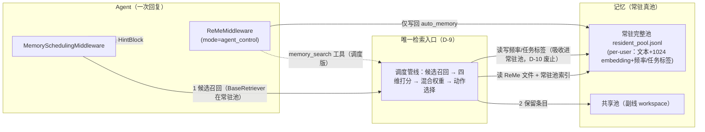
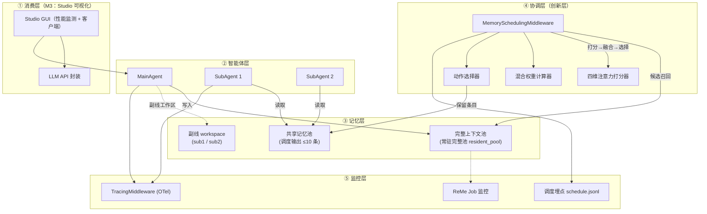
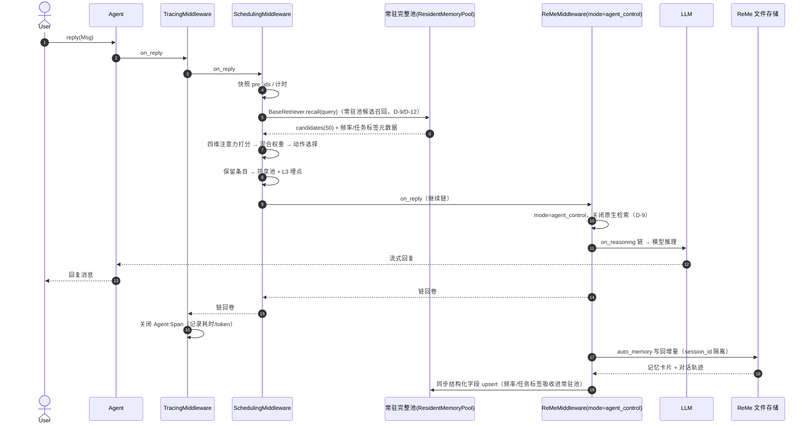
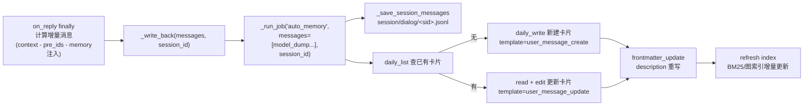
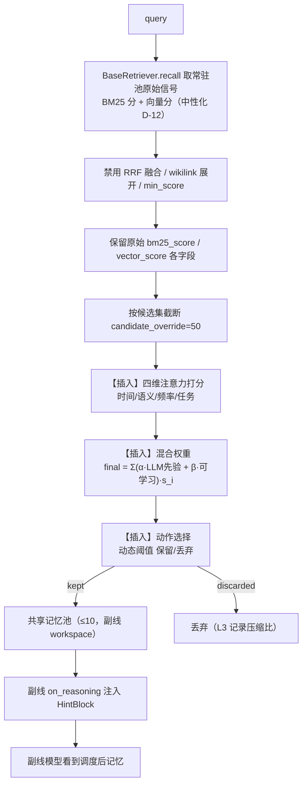
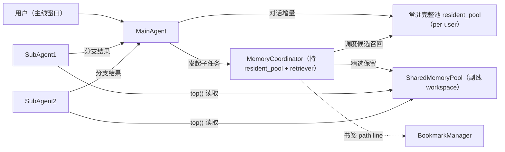
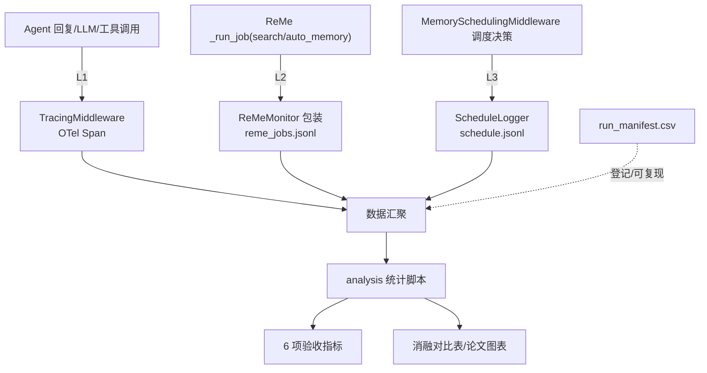
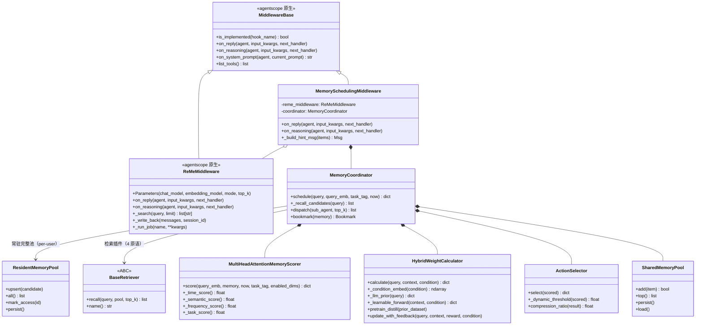
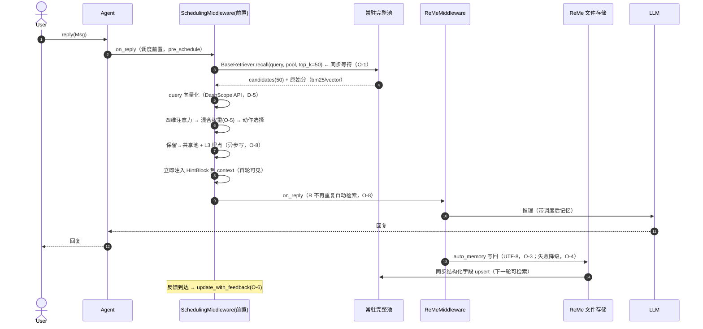
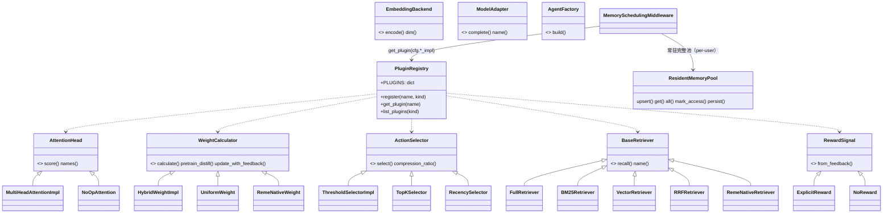

# 多智能体记忆共享调度系统 · 工程实现文档

> 课题：基于注意力引导和 LLMs 可学习权重的多智能体记忆共享调度方法研究（SRTP）
>   
> 文档类型：工程实现文档（需求-实现-链路梳理，粒度到方法层）
>   
> 依据：AgentScope 2.0.6 + reme-ai 0.4.1.6 实际源码（2026-08-14 核验）
>   
> 版本：v2.1（执行前定稿）｜ 编制日期：2026-08-19

---

## 目录

1. [文档说明](#1-文档说明)
2. [需求规格（REQ）](#2-需求规格req)
3. [总体设计](#3-总体设计)
4. [模块设计（方法级）](#4-模块设计方法级)
5. [数据与存储设计](#5-数据与存储设计)
6. [链路梳理（mermaid）](#6-链路梳理mermaid)
7. [已知问题与设计对策](#7-已知问题与设计对策)
8. [落地路线与里程碑](#8-落地路线与里程碑)
9. [测试与验收计划](#9-测试与验收计划)
10. [附录](#10-附录)
11. [补充设计（产品形态/学习回路/埋点/验收）](#11-补充设计产品形态学习回路埋点验收)
12. [插件式架构设计](#12-插件式架构设计)
13. [检索基座与 ReMe 原生原语划界（D-12）](#13-检索基座与-reme-原生原语划界d-12)

---

## 1. 文档说明

### 1.1 文档目的

将《AgentScope基座系统落地方案》v2.0 从"方案级"细化为"**方法级**"工程文档：每个模块给出**类的完整方法签名、职责、关键逻辑、异常与调用关系**，并基于**实际运行日志反向梳理代码路径**，输出优化后的目标链路。

### 1.2 读者对象

| 角色               | 关注章节                       |
| ---------------- | -------------------------- |
| 实现者（汤雅淇/李昕澜/涂卫健） | 第 3、4、5 章（可直接照着写代码）        |
| 算法负责人            | 第 4.2-4.5、7 章（打分/权重/选择器细节） |
| 导师/评审            | 第 2、6、8 章（需求、链路、计划）        |

### 1.3 依据的源码版本（已核验）

| 组件             | 版本      | 关键源码位置                                                                                |
| -------------- | ------- | ------------------------------------------------------------------------------------- |
| AgentScope     | 2.0.6   | `agentscope/agent/_agent.py`、`agentscope/middleware/_base.py`                         |
| ReMeMiddleware | 随 2.0.6 | `agentscope/middleware/_longterm_memory/_reme/_middleware.py`、`_tools.py`、`_utils.py` |
| reme-ai        | 0.4.1.6 | `site-packages/reme/`（`application.py`、`config/default.yaml`）                         |
| 消息块            | 2.0.6   | `agentscope/message/_block.py`（TextBlock/HintBlock 等）                                 |

### 1.4 术语表

| 术语          | 含义                                                                                                                                        |
| ----------- | ----------------------------------------------------------------------------------------------------------------------------------------- |
| Middleware  | AgentScope 2.0 的中间件，7 个 hook 拦截点（onion + transformer 模式）                                                                                  |
| Hook        | 中间件的回调方法：`on_reply` / `on_reasoning` / `on_acting` / `on_check_permission` / `on_model_call` / `on_compress_context` / `on_system_prompt` |
| ReMe        | local-first 文件化记忆层（"Memory as File"），论文已中 ACL 2026 Findings                                                                               |
| auto_memory | ReMe 的 LLM 蒸馏写记忆 Job（对话 → 记忆卡片）                                                                                                           |
| search      | ReMe 的渐进式混合检索 Job（BM25+向量，RRF 融合）                                                                                                         |
| 完整上下文池      | 常驻完整池（`resident_pool`，per-user 真池，全量记忆索引/摘要）                                                                                              |
| 共享记忆池       | 调度器从完整池精选出的子集（≤10 条，供副线使用）                                                                                                                |
| 四维注意力       | 时间/语义/频率/任务四个打分头                                                                                                                          |
| 混合权重        | LLM 先验权重 α 与可学习权重 β 的加权融合                                                                                                                 |
| RRF         | Reciprocal Rank Fusion，按名次融合多路召回                                                                                                          |
| HintBlock   | 2.0 的消息块类型，用于向模型注入"提示/记忆"内容                                                                                                               |

### 1.5 与既有文档的关系

| 文档                      | 本文档的关系                 |
| ----------------------- | ---------------------- |
| 《研究推进方案.md》             | 需求与里程碑来源（M1-M6）        |
| 《AgentScope基座系统落地方案.md》 | 架构输入（本文档是其细化）          |
| 《记忆模块算法解析与调度重构方案.md》    | 算法输入（ReMe 解析、方案 A）     |
| 《监控与实验数据采集方案.md》        | 监控/指标输入（本文档落地其 schema） |

---

## 2. 需求规格（REQ）

### 2.1 需求来源映射

| 来源                | 关键条款                                  | 落点           |
| ----------------- | ------------------------------------- | ------------ |
| 研究方案 1.2 核心目标     | 算法目标：四维注意力 + 混合权重；系统目标：多窗口 + 双池       | FR-3/4/5/6/7 |
| 研究方案 7.2/7.3 验收标准 | 记忆增删改查、检索准确率≥90%、延迟<100ms、Token 降 30% | NFR + 验收表    |
| 落地方案 2.2 中间件链     | 检索→打分→融合→选择→注入 全链路                    | FR-2~5       |
| 落地方案 3.4 三层监控     | Tracing / ReMe Job / 调度埋点             | FR-9         |
| 监控方案 6.1 指标字典     | 6 项验收指标 + 调度分析指标                      | 验收表 + FR-10  |
| 实测日志（2026-08-12）  | 连接失败、检索 0 命中、中文乱码                     | 第 7 章反向优化    |

### 2.2 功能需求（FR）

#### FR-1 记忆自动写入（无感持久化）

- 每次主线对话结束，自动将**本轮增量**（用户输入 + 全部 assistant 步骤 + 工具调用）通过 ReMe `auto_memory` 沉淀为记忆卡片与对话轨迹。
- 写入失败不得阻塞回复（best-effort，log 降级）。

#### FR-2 记忆检索

- 检索在**常驻完整池**（`resident_pool`，per-user）上进行，由 `BaseRetriever` 插件提供 4 个中性基座原语：全量传输（`retriever.full`）/ BM25 关键词召回（`retriever.bm25`）/ 向量余弦（`retriever.vector`）/ RRF 名次融合（`retriever.rrf`）。
- 不依赖 ReMe `_search`，不展开 wikilink、不按 min_score 过滤（归属划界，见 §13.2）。
- 候选集规模固定 `candidate_override=50`（调度层重排输入，统一口径，无 limit×5 派生）。

#### FR-3 四维注意力打分

- 对候选记忆逐条计算：时间（指数衰减）、语义（余弦 + 向量/BM25 原始分，与 ReMe RRF 解耦）、频率（访问次数编码）、任务（任务标签匹配）四维得分，输出可解释的分值分解。

#### FR-4 混合权重计算

- LLM 先验权重（多次采样取平均）+ 可学习权重（轻量模型）融合为动态四维权重重，并归一化。
- 支持在线更新（反馈驱动）。

#### FR-5 动作选择与调度决策

- 依据最终得分 + 动态阈值决定每条记忆**保留（进共享池）/ 丢弃**，替代固定 top_k。
- 输出压缩比、保留/丢弃集合。

#### FR-6 双池记忆架构

- 完整上下文池 = 常驻完整池（`resident_pool`，per-user 真池，全量、可追溯）。
- 共享记忆池 = 调度器精选输出（≤10 条、低延迟、可持久化）。

#### FR-7 主副线协同与隔离

- 主线维护完整池；副线从共享池获取调度后的精选记忆。
- 主/副线 workspace 隔离（互不污染上下文）。

#### FR-8 书签定位

- 复用 ReMe 检索结果 `path:start_line-end_line` 行号定位，实现"书签 = 位置快照 + 上下文提取"。

#### FR-9 三层监控

- L1 框架 Tracing（OTel，自动采集回复/LLM/工具 Span）。
- L2 ReMe Job 监控（包装 `_run_job`：入参/命中数/耗时）。
- L3 调度层埋点（四维得分、权重快照、保留/丢弃、延迟 → `schedule.jsonl`）。

#### FR-10 实验可复现

- 每次实验登记 `run_manifest.csv`（版本/参数/种子）。
- 指标以 JSONL 统一 schema 落盘，pandas 可直接读取。

#### FR-11 记忆工具（agent 自主检索）

- `memory_search` 工具（agent_control / both 模式）暴露给 LLM，可自主检索。

#### FR-12 配置集中管理

- 阈值、初始权重、workspace 路径、模式、top_k 等集中在配置文件，运行时可覆盖。

### 2.3 非功能需求（NFR）

| 编号    | 需求              | 量化目标                                                                   |
| ----- | --------------- | ---------------------------------------------------------------------- |
| NFR-1 | 调度决策延迟          | 全链路 < 1s（验收），其中打分 < 10ms/条、权重计算（可学习 MLP）< 20ms；LLM 先验为唯一慢环节，预算 ≤ 800ms |
| NFR-2 | 记忆检索延迟          | 单次检索 < 100ms（HNSW/批量向量化）                                               |
| NFR-3 | Token 经济性       | 相比基线降低 ≥ 30%                                                           |
| NFR-4 | 可观测性            | 三层数据全链路可追溯、可回放                                                         |
| NFR-5 | 零侵入框架           | 不修改 AgentScope / ReMe 源码，仅扩展                                           |
| NFR-6 | 可复现性            | 同配置+同种子 → 同指标                                                          |
| NFR-7 | 并发安全            | 多会话共享中间件不串扰（按 session_id 隔离）                                           |
| NFR-8 | 兼容性             | Python 3.13、AgentScope==2.0.6、reme-ai 锁版本                              |
| NFR-9 | embedding 成本与降级 | 外部 embedding 仅查重缓存后调用；API 不可用时降级为纯 RRF 检索（D-11）                        |

### 2.4 验收指标表（对齐监控方案 6.1；提升均相对 baseline-naive 计算）

| 指标          | 目标                             | 采集层     | 数据来源                      |
| ----------- | ------------------------------ | ------- | ------------------------- |
| 记忆召回准确率     | ≥85%（相对 baseline-naive 提升≥15%） | L3+离线标注 | schedule.kept vs 人工标注     |
| 任务完成率       | ≥90%（相对 baseline-naive 提升≥10%） | L1      | Agent span status         |
| 平均响应时间      | <3s（相对 baseline-naive 降低≥20%）  | L1      | Agent span duration       |
| 调度决策延迟      | <1s                            | L3      | schedule.latency_ms.total |
| Token 消耗降低率 | ≥30%（相对 baseline-naive）        | L1      | LLM span tokens           |
| 记忆池压缩比      | ≤0.3                           | L3      | kept/candidates           |

---

## 3. 总体设计

### 3.1 分层架构（插件式）

> 架构 = 固定内核 + 四层插件面 + 注册表装配。内核不插，组件经注册表按 `srtp.yaml` 的 `impl` 字段装配。原"五层+中间件链"设计已废弃。

```
固定内核（不插，定义本系统是什么）：
  双池语义（完整池=常驻索引 / 共享池≤10）
  + 协调管线（检索→打分→权重→选择→注入）
  + 数据模型 + 埋点
        │ 经 registry 按 config 装配以下四层插件面
┌──────────────────────────────────────────────────────────────────┐
│ 算法层（可插，含 桩/参考/完整 三态）                                │
│   AttentionHead · WeightCalculator · BaseRetriever(全量/BM25/向量/RRF) │
│   · ActionSelector · RewardSignal                                  │
├──────────────────────────────────────────────────────────────────┤
│ 基础设施层（可插）                                                  │
│   ModelAdapter（DeepSeek/DashScope/OpenAI）· EmbeddingBackend        │
│   · AgentFactory（main/sub/reviewer）                              │
├──────────────────────────────────────────────────────────────────┤
│ 消费层（可插，外接，核心零 UI 依赖）                                │
│   CLI · Studio 可视化（M3）· Notebook demo · Web UI                  │
├──────────────────────────────────────────────────────────────────┤
│ 基准/桩统一机制：同一注册表挑 桩(故意退化)/参考(wrap ReMe)/完整     │
└──────────────────────────────────────────────────────────────────┘
```

**双池语义（内核固定）**：完整池 = 调度层**常驻**维护的 memory 索引/摘要（per-user，含文本+embedding+元数据），不每次现查 ReMe；共享池 = 调度层从完整池精选的 ≤10 条（持久化到副线 workspace）。两池均按 **(user_id, session_id)** 隔离。

### 3.2 关键技术决策（D）

| 决策号  | 决策                                                                                                                                               | 理由                                                       | 来源         |
| ---- | ------------------------------------------------------------------------------------------------------------------------------------------------ | -------------------------------------------------------- | ---------- |
| D-1  | 方案 A：**包装 ReMeMiddleware**，在其上叠加调度中间件                                                                                                            | 复用 auto_memory/检索/文件化，开发量小                               | 算法解析 7.1   |
| D-2  | 调度逻辑放在**独立中间件** `MemorySchedulingMiddleware`，挂载在 ReMeMiddleware 之前                                                                               | on_reply 先调度、on_reasoning 先注入                            | 落地方案 2.2   |
| D-3  | **per-user 独立 workspace**：`data/reme/<user>/main`、`data/reme/<user>/sub*`，完整池常驻于该 workspace                                                      | 主/副线隔离 + user 隔离双维度，记忆不串味                                | 落地方案 3.1.3 |
| D-4  | 注入统一用 `HintBlock`（assistant-role Msg，name="memory"）                                                                                              | 与框架 formatter 兼容                                         | 源码核验       |
| D-5  | 开启 ReMe `embedding_store`，注入**外部 embedding API**（首选 DashScope `text-embedding-v4`，备选 OpenAI `text-embedding-3-small`；本地 BGE 仅作离线兜底）              | 语义注意力需要向量；外部 API 免本地算力、中文效果好，AgentScope 原生支持且自带缓存（接口已核验） | 实测：默认关闭    |
| D-6  | 可学习权重用轻量 PyTorch MLP（输入 query_emb + condition_emb → 四维权重），CPU 可训                                                                                                | 小样本、低算力                                                  | 研究方案 5.2   |
| D-7  | 埋点批量异步落盘（≥20 条一次），JSONL schema 对齐监控方案                                                                                                            | 最小开销、可复现                                                 | 监控方案 7     |
| D-8  | `reme-ai` 锁版本（0.4.1.6）                                                                                                                           | 上游重构频繁                                                   | 落地方案风险表    |
| D-9  | **单一检索入口**：ReMeMiddleware 设 `mode="agent_control"` 关闭自动检索；检索统一由调度中间件经 `BaseRetriever` 插件在**常驻完整池**上接管，`memory_search` 工具改为"调度版"                  | 消除"双检索双注入"冲突（见 3.5）                                      | 冲突分析       |
| D-10 | **元数据吸收进常驻完整池**：`access_count`/`task_tag`/`last_access` 作为常驻池每条 memory 的字段，无独立侧表                                                                 | 常驻池为真源后侧表冗余；仍对 ReMe 卡片只读                                 | 疑点审计       |
| D-11 | embedding **多层兜底（必做）**：DashScope API 主链路 → 重试/缓存 → 风控告警；仅当 API 完全不可用时 `semantic_score` 退回纯 `bm25_score` + 明确错误日志                                 | embedding 是向量检索的硬依赖，必须保证；异常时有兜底不阻塞                       | 用户拍板       |
| D-12 | **检索基座=4 插件原语**：在常驻完整池上自实现 `retriever.full`(全量传输)/`retriever.bm25`/`retriever.vector`(余弦)/`retriever.rrf`(融合)，**彻底禁用 wikilink 展开与 min_score 过滤** | 检索完全自有（与常驻真池一致），不再调 ReMe `_search`；保归因性                  | 疑点审计       |

### 3.3 包/目录结构（目标代码布局）

```
D:\SRTP_Multi_Agent_Memory\
├── main.py                        # 装配入口：加载 srtp.yaml、构建主副线、启动演示/实验
├── srtp_memory/                   # 核心包（headless，不依赖 UI）
│   ├── config.py                  # SchedulingConfig（Pydantic，含 *_impl 字段）
│   ├── middleware.py              # MemorySchedulingMiddleware（总入口）
│   ├── resident_pool.py           # ResidentMemoryPool（常驻完整池，per-user，含 embedding+元数据）
│   ├── vector_index.py            # faiss 向量索引封装（ANN 查询，NFR-2；不可用时线性兜底）
│   ├── retriever.py               # BaseRetriever 抽象 + 5 实现注册（full/bm25/vector/rrf/reme）
│   ├── attention.py               # MultiHeadAttentionImpl（四维打分，含 enabled_dims 掩码）
│   ├── weights.py                 # HybridWeightImpl（条件化混合权重）
│   ├── selector.py                # ThresholdSelectorImpl（动作选择）
│   ├── shared_pool.py             # SharedMemoryPool（≤10，持久化到副线 workspace）
│   ├── coordinator.py             # MemoryCoordinator（持常驻池+共享池，按 (user_id,session_id) 隔离）
│   ├── condition.py               # ConditionStore（user/scenario/business → 嵌入）
│   ├── agents.py                  # 主/副线 Agent 工厂
│   ├── monitor/
│   │   ├── schedule_logger.py     # ScheduleLogger（L3）
│   │   ├── reme_monitor.py         # ReMeMonitor（L2）
│   │   └── run_registry.py        # run_manifest + ablation_manifest 登记
│   ├── train/
│   │   ├── distill.py             # 离线 MSE 蒸馏预训练
│   │   └── feedback_loop.py       # 在线 RL 反馈闭环
│   └── plugins/                   # 插件包（薄注册表 + 分类）
│       ├── registry.py            # @register + PLUGINS + get_plugin
│       ├── base.py                # 全部 ABC（含 BaseRetriever、EmbeddingBackend）
│       ├── algorithms/            # 算法层插件（完整+桩），含 retrieval/ 子包
│       ├── infra/                 # ModelAdapter / EmbeddingBackend / AgentFactory
│       └── baselines/             # 基准/桩实现
├── analysis/                      # 统计脚本
│   ├── load_data.py
│   ├── compute_metrics.py
│   ├── gen_ablation_manifest.py   # 从 ablation/*.yaml 生成 ablation_manifest.json
│   └── plot.py
├── config/
│   ├── srtp.yaml                  # 主配置（impl 字段选插件）
│   └── ablation/                  # 唯一手写真源：5 组 YAML
│       ├── baseline_naive.yaml
│       ├── baseline_reme.yaml
│       ├── +attention.yaml
│       ├── +weight.yaml
│       └── full_ours.yaml
├── data/
│   ├── reme/<user>/main/          # 主线常驻完整池 workspace（per-user）
│   ├── reme/<user>/sub*/          # 副线 workspace（含 shared_pool.json）
│   ├── metrics/                   # schedule.jsonl / reme_jobs.jsonl（不含 memory_meta/共享池）
│   └── runs/                      # run_manifest.csv + 单次实验目录
└── examples/
    ├── reme_demo.py               # 已有：ReMe 最小示例（保留，作为基线参考）
    └── sched_demo.py              # 新增：调度系统端到端演示
```

### 3.4 中间件链设计（挂载顺序）

```
Agent.middlewares = [
    TracingMiddleware(),                  # ① L1 全链路追踪（链首）
    MemorySchedulingMiddleware(...),      # ② 调度（检索→打分→融合→选择→注入）
    ReMeMiddleware(..., mode="agent_control"),  # ③ ReMe 仅写回 + 提供 memory_search；自动检索由 ② 接管（D-9）
]
```

**hook 执行顺序（一次回复）**：

1. `TracingMiddleware.on_reply` → 开启 Agent Span
2. `MemorySchedulingMiddleware.on_reply` → 快照 pre_ids、启动**调度管线**（候选召回→打分→权重→选择→共享池）
3. `ReMeMiddleware.on_reply` → 快照 pre_ids、yield 链（`mode="agent_control"` 下**不启动**自动检索任务）
4. `_reply_impl` → ReAct 循环：`on_reasoning`（先 MemoryScheduling 注入调度结果；ReMe 无自动检索故不再注入）→ `_reasoning_impl` → LLM → 工具循环
5. 链回卷：ReMe finally 写回增量 → MemoryScheduling finally 收尾 → Tracing 关 Span

> **要点**：由于 D-9，整条链路中记忆检索只有**一个入口**（调度管线），记忆注入只有**一份 HintBlock**（`name="memory"`），杜绝双份记忆与 Token 浪费。

### 3.5 与 ReMe 原生记忆机制的冲突分析（D-9/D-10 依据）

#### 3.5.1 冲突矩阵

| #   | 冲突点               | 根因（源码证据）                                                                                                            | 影响                                                                 | 消除方案                                                |
| --- | ----------------- | ------------------------------------------------------------------------------------------------------------------- | ------------------------------------------------------------------ | --------------------------------------------------- |
| C-1 | **双检索双注入**        | `ReMeMiddleware.on_reply` 在 `mode≠"agent_control"` 时无条件启动异步检索任务；`on_reasoning` 完成后追加 HintBlock。调度中间件也做检索+注入         | 同一记忆被注入两份，上下文膨胀、Token 翻倍、检索任务重复浪费 LLM/embedding 调用                 | **D-9 单一检索入口**                                      |
| C-2 | **文件写回竞争**        | `auto_memory` 通过 read+edit 工具**编辑同一张 daily 卡片**（实测日志：`[EditStep] edited path=...count=1`），且 `watch_changes` 会触发索引重建 | 若调度层再把 `access_count/task_tag` 写进 frontmatter，两写者并发编辑同一文件 + 索引反复重建 | **D-10（元数据吸收进常驻池，侧表废止）**，调度层只读 ReMe 文件，频率/任务标签写入常驻池 |
| C-3 | **私有方法耦合**        | 调度层调用 `ReMeMiddleware._search` / `_run_job`（前导下划线私有）                                                                | 上游 2.0.x 重构即破坏                                                     | 锁版本 + `ReMeAdapter` 防御性封装（duck-typing，异常降级为纯 BM25）  |
| C-4 | **会话隔离**（非冲突，需确认） | 两边都从 `agent.state.session_id` 读，同一 Agent 同源                                                                         | —                                                                  | 天然一致，无需处理                                           |
| C-5 | **系统提示拼接**（非冲突）   | `on_system_prompt` 为字符串 append                                                                                      | 顺序敏感                                                               | 调度提示追加在 ReMe 工具提示之后                                 |

#### 3.5.2 消除后：单一检索入口



#### 3.5.3 判定

**调度层与 ReMe 原生机制是"包装+接管"关系而非叠加关系**：写回、索引、文件化全部复用 ReMe；检索、注入、打分、调度全部由调度层接管。两者职责互斥，冲突经 D-9/D-10 消除后为零重叠。

---

## 4. 模块设计（方法级）

> 约定：所有异步方法均为 `async def`；`next_handler` 为链式调用句柄；除特别说明外，异常均降级为日志不抛出（保持"写入/调度不阻塞回复"原则）。

### 4.1 `srtp_memory/config.py` — 配置

```python
from pydantic import BaseModel, Field

class SchedulingConfig(BaseModel):
    """调度层全部可调参数（对应 config/srtp.yaml）"""
    threshold: float = 0.6            # 动作选择初始阈值（FR-5）
    max_shared: int = 10              # 共享池上限（FR-6）
    alpha: float = 0.6                # LLM 先验权重占比（FR-4）
    beta: float = 0.4                 # 可学习权重占比（FR-4）
    top_k: int = 5                    # 共享池注入上限保护（FR-2）
    candidate_override: int = 50      # 调度候选集规模（统一 50，FR-2）
    task_tag: str = "main_task"       # 当前任务标签（任务注意力）
    llm_prior_samples: int = 1        # LLM 先验采样次数（实时小模型，单次，预算 ≤800ms）
    retrieval_mode: str = "pre_schedule"  # pre_schedule（默认，回复前同步调度）| async_best_effort（实验对照）
    condition_key: str = "u_tu|research|srtp"  # 当前条件键（user|scenario|business）
    embedding_provider: str = "dashscope"   # 外部 embedding 供应商：dashscope/openai/local（D-5）
    embedding_model: str = "text-embedding-v4"   # embedding 模型名（D-5）
    embedding_dimensions: int = 1024   # 向量维度（DashScope text-embedding-v4=1024）
    embedding_cache: bool = True       # 启用 AgentScope 内置 embedding 缓存（D-11）
    log_dir: str = "data/metrics"     # L3 埋点目录（FR-9）
    run_id: str | None = None         # 实验登记号（FR-10）
    # 插件选择（config-as-composition，§12.5；无 store_impl，双池为内核具体类，V2.1）
    retriever_impl: str = "retriever.bm25"
    attention_impl: str = "attention.full"
    weight_impl: str = "weight.full"
    selector_impl: str = "selector.full"
    embedding_impl: str = "embed.dashscope"
    reward_impl: str = "reward.explicit"
    model_impl: str = "model.deepseek"
    factory_impl: str = "factory.role"
```

**方法**：

| 方法           | 签名                                                | 职责                      |
| ------------ | ------------------------------------------------- | ----------------------- |
| `load(path)` | `classmethod load(path: str) -> SchedulingConfig` | 从 YAML 读取配置并校验；缺失字段用默认值 |

### 4.2 `srtp_memory/attention.py` — 四维注意力打分器（FR-3）

```python
import math, numpy as np

ALL_DIMS = ["time", "semantic", "frequency", "task"]
DEFAULT_WEIGHTS = {"time": 0.25, "semantic": 0.35, "frequency": 0.15, "task": 0.25}

class MultiHeadAttentionMemoryScorer:
    def __init__(self, weights: dict[str, float] | None = None):
        """默认权重 DEFAULT_WEIGHTS = {time:0.25, semantic:0.35, frequency:0.15, task:0.25}
        （实际运行时被 HybridWeightCalculator 动态覆盖；回退/桩实现同用此常量）"""
        self.weights = weights or dict(DEFAULT_WEIGHTS)

    def score(self, query_emb, memory, current_time, task_tag,
              enabled_dims: set[str] | None = None) -> dict[str, float]:
        """四维打分 + 加权融合；enabled_dims=None 表示四维全开。
        enabled_dims 掩码：关掉的维权重强制 0，其余归一化保持 Σ=1，
        支持 REQ-610 四维分别验证（单插件不碎片化，不拆 4 个插件）。"""
        dims = set(enabled_dims) if enabled_dims else set(ALL_DIMS)
        s = {
            "time":      self._time_score(memory, current_time),
            "semantic":  self._semantic_score(query_emb, memory),
            "frequency": self._frequency_score(memory),
            "task":      self._task_score(memory, task_tag),
        }
        eff_w = {d: (self.weights[d] if d in dims else 0.0) for d in ALL_DIMS}
        norm = sum(eff_w.values()) or 1.0
        final = sum(eff_w[d] * s[d] for d in ALL_DIMS) / norm
        return {"final": final, **s}
```

**方法**（核心评分逻辑，全部纯函数、可单测）：

| 方法                                                                            | 签名                                                                                                                  | 关键逻辑                                                                                                                                                       |
| ----------------------------------------------------------------------------- | ------------------------------------------------------------------------------------------------------------------- | ---------------------------------------------------------------------------------------------------------------------------------------------------------- |
| `score(query_emb, memory, current_time, task_tag, enabled_dims=None) -> dict` | `score(self, query_emb, memory, current_time, task_tag, enabled_dims: set[str] \| None = None) -> dict[str, float]` | `enabled_dims` 掩码——关掉的维权重强制 0，其余归一化融合；`final = Σ eff_w_i·s_i / Σ eff_w_i`；返回 `{final, time, semantic, frequency, task}`                                    |
| `_time_score(memory, current_time) -> float`                                  | `_time_score(self, memory, current_time: float) -> float`                                                           | 指数衰减：`t=(now-ts)/3600.0`；`s=exp(-λ·t)`，λ 默认 0.01（可配置）                                                                                                      |
| `_semantic_score(query_emb, memory) -> float`                                 | `_semantic_score(self, query_emb: np.ndarray, memory) -> float`                                                     | 独立融合：`s = w_cos·cosine(query_emb, mem.embedding) + w_vec·mem.vector_score + w_bm25·mem.bm25_score`（w_cos=0.5/w_vec=0.3/w_bm25=0.2），与 ReMe RRF **解耦**（D-12） |
| `_frequency_score(memory) -> float`                                           | `_frequency_score(self, memory) -> float`                                                                           | 频率编码：`s = 1 - exp(-0.1·access_count)`                                                                                                                      |
| `_task_score(memory, task_tag) -> float`                                      | `_task_score(self, memory, task_tag: str) -> float`                                                                 | 任务标签匹配：`1.0 if mem.task_tag==task_tag else 0.3`                                                                                                            |

> **enabled_dims 掩码（REQ-610）**：消融要"四维分别验证"时，传 `enabled_dims={"semantic","task"}` 即只让语义/任务两维参与融合、其余权重强制 0；**不需要**把四维拆成 4 个插件（避免碎片化）。`NoOpAttention` 等价于 `enabled_dims=set()`（四维全 0，仅作占位退化）。
>   
> **命名约定**：`_semantic_score` 内部系数用 `w_cos/w_vec/w_bm25`，与全局 `α/β`（先验/可学习融合系数）区分，避免歧义。

**输入类型 `MemoryCandidate`**（dataclass，由 `BaseRetriever` 在常驻池上构建）：

```python
@dataclass
class MemoryCandidate:
    memory_id: str            # 唯一主键（uuid，引用/更新用）
    text: str                 # 记忆文本（来自常驻池 resident_pool.jsonl）
    path: str                 # 源文件路径（书签辅助定位，FR-8）
    start_line: int           # 行号起点
    end_line: int             # 行号终点
    timestamp: float          # 记忆时间戳
    access_count: int         # 访问次数（L3 维护）
    task_tag: str | None      # 任务标签
    user_id: str              # 归属用户（隔离过滤维度）
    session_id: str           # 归属会话（隔离过滤维度）
    bm25_score: float         # 常驻池 BM25 原始分（中性基座，D-12）
    vector_score: float       # 常驻池向量原始分（中性基座，D-12）
    embedding: np.ndarray | None  # 1024 维向量（外部 API 生成；缺失时 semantic 仅用 bm25_score，D-11）
```

### 4.3 `srtp_memory/weights.py` — 混合权重计算器（FR-4，条件化）

> 权重模型 =「**条件化 MLP**」：一份模型，输入拼 `condition_emb(user/scenario/business)`，仅 semantic/task 两维受 condition 调制（time/frequency 保持全局）。`α/β` 在 V1 **固定**（config），不学习。学习回路详见 §11.2。
> **V2.1 修正（执行前定稿）**：可学习 MLP 输入 = `query_emb`（1024 维）+ `condition_emb`（用户/场景哈希向量），**不输入召回集合统计特征**（候选数/平均分/时间衰减等）——权重生成基于用户提问（与 LLM 先验同源），MLP 通过蒸馏复现 LLM 先验判断。

```python
@dataclass
class ConditionKey:
    user_id: str | None = None       # 用户标识（个性化轴 1）
    scenario_id: str | None = None   # 场景标识（个性化轴 2）
    business_id: str | None = None   # 业务标识（个性化轴 3）

class HybridWeightCalculator:
    def __init__(self, llm_client, embed_model=None,
                 alpha: float = 0.6, beta: float = 0.4,
                 prior_samples: int = 1, lr: float = 0.01,
                 conditioning_dims: tuple[str, ...] = ("semantic", "task"),
                 condition_emb_dim: int = 32):
        """条件化权重模型：轻量 PyTorch MLP。
        - 输入 = query_emb(1024) 拼接 condition_emb(32) → MLP → 四维权重
        - 仅 conditioning_dims（默认 semantic/task）受 condition 调制；time/frequency 全局分支（降方差、防稀疏）
        - α/β 固定（config），V1 不学习（REQ-404 保底 + REQ-610 归因干净）
        - LLM 先验：实时调用轻量小模型，单次采样，预算 ≤800ms（NFR-1 全链路 <1s）
        """
```

**方法**：

| 方法 | 签名 | 关键逻辑 |
|------|------|---------|
| `calculate(query_emb, condition) -> dict` | `calculate(self, query_emb: np.ndarray, condition: ConditionKey) -> dict[str, float]` | ① `_llm_prior(query)`（query 文本经 LLM 先验）；② `_learnable_forward(query_emb, condition)`（可学习 MLP，毫秒级）；③ `hybrid=α·prior+β·learnable`（仅 conditioning_dims 用条件化输出，其余维用全局头）；④ `_normalize`。注：`_llm_prior` 需要 query 文本，由调用方传入（见 §4.7 on_reply 同时持有 query 文本与向量） |
| `_condition_embed(condition) -> np.ndarray` | `_condition_embed(self, condition: ConditionKey) -> np.ndarray` | user/scenario/business 各自**哈希查表**为定长向量拼接为 `condition_emb_dim` 维；未知 user → 零向量（冷启动退化为全局） |
| `_learnable_forward(query_emb, condition) -> dict` | `_learnable_forward(self, query_emb: np.ndarray, condition: ConditionKey) -> dict[str, float]` | `query_emb + condition_emb` → MLP → softmax 四维权重；仅 conditioning_dims 受 condition 调制，time/frequency 由全局分支输出 |
| `_llm_prior(query) -> dict` | `_llm_prior(self, query: str) -> dict[str, float]` | Prompt："为当前查询分配四维注意力权重（time/semantic/frequency/task），JSON 输出，和为 1"。**实时调用轻量小模型（Qwen-flash / glm-4-flash 级），单次采样**；失败时回退 `DEFAULT_WEIGHTS`（{time:0.25, semantic:0.35, frequency:0.15, task:0.25}） |
| `pretrain_distill(prior_dataset) -> None` | `pretrain_distill(self, prior_dataset: list) -> None` | **离线预训练（阶段一）**：`for q_emb, cond, target_w in prior_dataset: loss=MSE(_learnable_forward(q_emb,cond), target_w); loss.backward(); opt.step()`。target_w = LLM 先验权重（蒸馏，§11.2） |
| `update_with_feedback(query_emb, reward, condition) -> None` | `update_with_feedback(self, query_emb: np.ndarray, reward: float, condition: ConditionKey) -> None` | **在线优化（阶段二）**：reward∈{+1 赞/-1 踩}，仅对 condition 切片做一步 bandit 式梯度更新（reward 加权），投影回 simplex；受 REQ-405 正则化约束（β 不偏离 LLM 先验） |
| `_normalize(weights) -> dict` | `_normalize(self, weights: dict) -> dict[str, float]` | 除以总和，保证 `Σw=1` |

### 4.4 `srtp_memory/selector.py` — 动作选择器（FR-5）

```python
class ActionSelector:
    def __init__(self, threshold: float = 0.6, max_shared: int = 10):
        self.threshold, self.max_shared = threshold, max_shared
```

**方法**：

| 方法                                    | 签名                                                      | 关键逻辑                                                                                                                                |
| ------------------------------------- | ------------------------------------------------------- | ----------------------------------------------------------------------------------------------------------------------------------- |
| `select(scored_memories) -> dict`     | `select(self, scored_memories: list[dict]) -> dict`     | `kept = [m for m in scored if m["score"]["final"] >= _dynamic_threshold(scored)]`；按 final 降序；截断 `max_shared`；返回 `{kept, discarded}` |
| `_dynamic_threshold(scored) -> float` | `_dynamic_threshold(self, scored: list[dict]) -> float` | 自适应阈值：`max(threshold, mean(finals) - 0.5·std(finals))`，避免候选整体偏低时全丢                                                                  |
| `compression_ratio(result) -> float`  | `compression_ratio(self, result: dict) -> float`        | `len(kept)/len(scored)`（验收 ≤0.3）                                                                                                    |

### 4.5 `srtp_memory/shared_pool.py` — 共享记忆池（FR-6/FR-7）

```python
class SharedMemoryPool:
    def __init__(self, max_size: int = 10, persist_path: str | None = None):
        """persist_path 默认 data/reme/<user>/sub<N>/shared_pool.json
        （从 metrics/ 挪出，落副线 workspace，与副线 ReMe 同目录；隔离随 user/session）"""
        self._items: list[dict] = []   # [{text, path, start_line, end_line, score, timestamp}]
```

**方法**：

| 方法                    | 签名                                                                          | 关键逻辑                                                                      |
| --------------------- | --------------------------------------------------------------------------- | ------------------------------------------------------------------------- |
| `add(item) -> bool`   | `add(self, item: dict) -> bool`                                             | 按分数插入有序列表；超过 `max_size` 丢弃最低分；返回是否进入                                      |
| `top() -> list[dict]` | `top(self) -> list[dict]`                                                   | 返回当前保留的**全部**条目（≤`max_size`），供副线中间件注入 HintBlock（副线吃全量精选集，不二次检索；无 query()） |
| `clear() -> None`     | `clear(self) -> None`                                                       | 清空池（会话重置 / 主副线切换时调用）                                                      |
| `persist() / load()`  | `persist(self) -> None` / `classmethod load(cls, path) -> SharedMemoryPool` | JSON 序列化到 `persist_path`（默认副线 workspace `shared_pool.json`），支持跨进程恢复       |

> **共享池不设 query() 的理由**：共享池是调度层精选的 ≤10 条"已排序高相关集"，副线直接全量注入即可；若再对池内做余弦检索会引入第二排序环，破坏"排序/选择为唯一变量"的消融常量（§9.4）。需要"按需取子集"时由副线中间件按 `max_shared` 截断 `top()` 结果。

### 4.5.1 `srtp_memory/resident_pool.py` — 常驻完整池（per-user 真池）

> 调度层自维护的**常驻** memory 索引/摘要，不每次现查 ReMe（D-9 依据）。每条记录含 `memory_id` 主键 + 文本 + 1024 维 embedding + 元数据，`(user_id, session_id)` 隔离。**内置 faiss 向量索引**（`VectorIndex`，IndexFlatIP 精确内积 + L2 归一化 = 余弦）：upsert 同步维护，供 `retriever.vector` 做 ANN 查询（实测 1000 条记忆 < 1ms，NFR-2 <100ms 达标；faiss 不可用时自动线性余弦兜底，D-11）。

```python
class ResidentMemoryPool:
    def __init__(self, user_id: str, session_id: str, path: str,
                 with_vector_index: bool = True):
        """path 默认 data/reme/<user>/main/resident_pool.jsonl（per-user）
        with_vector_index=True：维护 faiss 向量索引（upsert 同步），供 ANN 查询。"""

    def upsert(self, candidate: MemoryCandidate) -> None: ...   # 按 memory_id 写入/更新（含向量索引同步）
    def get(self, memory_id: str) -> MemoryCandidate | None: ...  # 按 memory_id 主键精确读取
    def all(self) -> list[MemoryCandidate]: ...                  # 全量（retriever.full 用）
    def mark_access(self, memory_id: str) -> None: ...           # access_count += 1（频率头/L3 同源）
    def persist(self) -> None: ...                               # 落盘 resident_pool.jsonl
```

**主键与隔离约定**：

- `memory_id`（uuid）= 每条记忆的**唯一主键**，负责引用/更新（`get`/`mark_access`/`upsert`）。
- `user_id` + `session_id` = **归属字段（隔离过滤维度）**：查询先按 `(user_id, session_id)` 过滤，再按 `memory_id` 精确定位。
- `path:start_line-end_line` = 书签辅助定位（FR-8），不作主键（内容更新时引用会漂移）。

**与 ReMe 关系**：ReMe 仍负责 auto_memory 写卡片（对话 → 记忆），调度层在写完/读后把结构化字段同步进常驻池；调度层对 ReMe 卡片**只读**（冲突分析 3.5 C-2）。检索、打分、权重、选择四环全部基于常驻池，与 ReMe `_search` 解耦（D-9/D-12）。

**同步时序（设计预期）**：`auto_memory` 在回复 finally 阶段写卡片，随后调度层 upsert 进常驻池 → **当轮新记忆本轮不可检索，下一轮才可检索**（"延迟一轮"为既定行为，文档明确记录，不作为缺陷）。

### 4.6 `srtp_memory/coordinator.py` — 调度编排（FR-5/6/7 总装配）

```python
class MemoryCoordinator:
    def __init__(self, resident_pool: "ResidentMemoryPool", retriever,
                 scorer, weights, selector, shared_pool: "SharedMemoryPool",
                 user_id: str, session_id: str,
                 logger: "ScheduleLogger | None" = None):
        """持常驻完整池（resident_pool，per-user 真池）+ 检索插件（retriever）
        + 四维打分器 + 混合权重 + 选择器 + 共享池；按 (user_id, session_id) 隔离。
        不持有 ReMeMiddleware（检索由 retriever 在常驻池上接管，D-9）。"""
```

**方法**：

| 方法                                                   | 签名                                                              | 关键逻辑                                                                                                                                                                                                                     |
| ---------------------------------------------------- | --------------------------------------------------------------- | ------------------------------------------------------------------------------------------------------------------------------------------------------------------------------------------------------------------------ |
| `schedule(query, query_emb, task_tag, now) -> dict`  | `schedule(self, query, query_emb, task_tag, now) -> dict`       | ① `_recall_candidates(query)`（常驻池召回，`candidate_override=50`）；② 逐条 `scorer.score(..., enabled_dims=...)`；③ `weights.calculate` 得动态权重 → 重算 final；④ `selector.select`；⑤ 写入共享池 `add`；⑥ L3 埋点（含 user_id/session_id）；返回结果 dict |
| `_recall_candidates(query) -> list[MemoryCandidate]` | `_recall_candidates(self, query: str) -> list[MemoryCandidate]` | 调 `self.retriever.recall(query, self.resident_pool, top_k)`（BaseRetriever 在常驻池上实现 full/bm25/vector/rrf 四选一，**不分头取分**，D-12），返回 `MemoryCandidate` 列表；禁用 wikilink 展开与 min_score 过滤                                          |
| `dispatch(sub_agent, top_k=10) -> list[dict]`        | `dispatch(self, sub_agent, top_k: int = 10) -> list[dict]`      | 共享池 `top()` 全量（≤10）格式化后交副线中间件注入 HintBlock；`top_k` 仅作上限保护                                                                                                                                                                 |
| `bookmark(memory) -> Bookmark`                       | `bookmark(self, memory: MemoryCandidate) -> Bookmark`           | 生成书签：`{path, start_line, end_line, snapshot_text, created_at}`（FR-8）                                                                                                                                                     |

### 4.7 `srtp_memory/middleware.py` — 调度中间件（核心总入口）

```python
from agentscope.middleware import MiddlewareBase

class MemorySchedulingMiddleware(MiddlewareBase):
    def __init__(self, reme_middleware, embed_model, llm_client,
                 config: SchedulingConfig | None = None,
                 log_path: str = "data/metrics/schedule.jsonl",
                 task_tag: str | None = None):
        self._reme = reme_middleware          # 包装的 ReMeMiddleware（仅写回 + memory_search 工具）
        self.scorer = MultiHeadAttentionMemoryScorer()
        self.weights = HybridWeightCalculator(llm_client, embed_model, ...)
        self.selector = ActionSelector(config.threshold, config.max_shared)
        self.coordinator = MemoryCoordinator(...)
        self._shared_pool = SharedMemoryPool(...)
        self._logger = ScheduleLogger(log_path)
        self._task_tag = task_tag
```

**方法**（hook 实现，粒度到执行步骤）：

| 方法                 | 签名                                                                                    | 关键逻辑（逐步）                                                                                                                                                                                                                                                              |
| ------------------ | ------------------------------------------------------------------------------------- | --------------------------------------------------------------------------------------------------------------------------------------------------------------------------------------------------------------------------------------------------------------------- |
| `on_reply`         | `async on_reply(self, agent, input_kwargs: dict, next_handler) -> AsyncGenerator`     | ① `query = _extract_query_text(inputs)`；② 有 query 时：`t0` 计时 → `query_emb = embed_model.encode(query)` → `result = coordinator.schedule(query, query_emb, task_tag, now)`；③ `async for item in next_handler(**input_kwargs): yield item`；④ finally：清空本轮检索任务、确保埋点 flush |
| `on_reasoning`     | `async on_reasoning(self, agent, input_kwargs: dict, next_handler) -> AsyncGenerator` | ① 若共享池本轮有更新：`agent.state.context.append(_build_hint_msg(pool.top()))`（assistant-role Msg + HintBlock，name="memory"）；② `async for event in next_handler(**input_kwargs): yield event`                                                                                  |
| `on_system_prompt` | `async on_system_prompt(self, agent, current_prompt: str) -> str`                     | 在 ReMe 的 memory_search 提示之外追加调度说明：`"已注入的调度记忆以 Relevant memories 形式出现在对话中，直接使用即可"`                                                                                                                                                                                     |
| `list_tools`       | `async list_tools(self) -> list[ToolBase]`                                            | 返回**调度版** `memory_search`（包装本中间件的调度管线，而非原生 `_search`，D-9）；`agent_control`/`both` 模式时暴露                                                                                                                                                                                |
| `_build_hint_msg`  | `@staticmethod _build_hint_msg(items: list[dict]) -> Msg`                             | 格式化 `## Shared memories (scheduled)\n- <text> (<path>:<line>)` 为 HintBlock                                                                                                                                                                                            |
| `close`            | `async close(self) -> None`                                                           | 关闭 ReMe 底层 + flush 埋点缓冲区                                                                                                                                                                                                                                              |

### 4.8 `srtp_memory/agents.py` — 主副线 Agent 工厂（FR-7）

| 方法                                              | 签名                                                                                    | 关键逻辑                                                                                                                                               |
| ----------------------------------------------- | ------------------------------------------------------------------------------------- | -------------------------------------------------------------------------------------------------------------------------------------------------- |
| `build_main_agent(model, config) -> Agent`      | `build_main_agent(model: ChatModelBase, config: SchedulingConfig) -> Agent`           | 构建主线：workspace=`data/reme/<user>/main`（per-user），middlewares=[Tracing, Scheduling(包 main ReMe), main ReMe]，toolkit=memory_search                   |
| `build_sub_agent(name, model, config) -> Agent` | `build_sub_agent(name: str, model: ChatModelBase, config: SchedulingConfig) -> Agent` | 构建副线：workspace=`data/reme/<user>/<name>`，middlewares=[Tracing, Scheduling(包 sub ReMe, 共享同一 coordinator 实例), sub ReMe]                              |
| `_build_reme(workspace) -> ReMeMiddleware`      | `_build_reme(workspace: str, model, embed_model) -> ReMeMiddleware`                   | 统一 ReMe 构造：`Parameters(chat_model=model, embedding_model=embed_model, mode="agent_control", top_k=config.top_k)`（`embed_model` 为外部 API 模型，D-5/D-9） |

### 4.9 `srtp_memory/monitor/` — 监控（FR-9/FR-10）

#### 4.9.1 `ReMeMonitor`（L2：Job 监控）

| 方法                                              | 签名                                                                              | 关键逻辑                                                                                                      |
| ----------------------------------------------- | ------------------------------------------------------------------------------- | --------------------------------------------------------------------------------------------------------- |
| `record_job(name, kwargs, result, duration_ms)` | `record_job(self, name: str, kwargs: dict, result, duration_ms: float) -> None` | 写 JSONL 行 `{event:"reme_job", job, timestamp, duration_ms, params, result_summary}`；缓冲 ≥50 条批量落盘（NFR-4/7） |
| `flush`                                         | `flush(self) -> None`                                                           | 清空缓冲写盘                                                                                                    |

#### 4.9.2 `ScheduleLogger`（L3：调度埋点）

| 方法                       | 签名                                           | 关键逻辑                                                                                                                                                                                        |
| ------------------------ | -------------------------------------------- | ------------------------------------------------------------------------------------------------------------------------------------------------------------------------------------------- |
| `log_schedule(entry)`    | `log_schedule(self, entry: dict) -> None`    | 写 `{event:"schedule", run_id, session_id, agent, timestamp, query, task_tag, candidate_count, weights, score_stats, kept_count, discarded_count, compression_ratio, latency_ms}`；缓冲 ≥20 条落盘 |
| `_score_summary(scored)` | `_score_summary(self, scored: list) -> dict` | 压缩为 mean/max/min/p50（避免日志过大）                                                                                                                                                                |
| `flush`                  | `flush(self) -> None`                        | 清空缓冲写盘                                                                                                                                                                                      |

### 4.10 `main.py` — 装配入口

| 方法              | 签名                                               | 关键逻辑                                                                                                                                   |
| --------------- | ------------------------------------------------ | -------------------------------------------------------------------------------------------------------------------------------------- |
| `main()`        | `def main() -> None`                             | ① 加载 `config/srtp.yaml`；② 选模型（DeepSeek 优先）；③ `build_main_agent` + `build_sub_agent`；④ 跑端到端演示（主线写→副线查→验证调度注入）；⑤ `run_manifest.csv` 登记一行 |
| `_pick_model()` | `def _pick_model() -> tuple[ChatModelBase, str]` | 复用 `examples/reme_demo.py` 逻辑：DeepSeek → DashScope → OpenAI；无 key 时返回 None（初始化模式）                                                      |

### 4.11 外部依赖接口（AgentScope 原生，本文档只调用不修改）

| 组件                                                                             | 关键接口（已核验签名）                                                                       | 用途                                     |
| ------------------------------------------------------------------------------ | --------------------------------------------------------------------------------- | -------------------------------------- |
| `Agent.__init__(name, system_prompt, model, toolkit, middlewares, state, ...)` | 挂载中间件链；`state: AgentState` 可注入 `session_id`                                       | FR-7                                   |
| `AgentState.session_id`                                                        | `Field(default_factory=_generate_id)`，每次新 Agent 自动生成；可显式注入固定 id 恢复会话              | 会话隔离                                   |
| `MiddlewareBase` 7 hooks + `is_implemented`                                    | `Agent.__init__` 按 hook 分组过滤中间件                                                   | 扩展点                                    |
| `ReMeMiddleware._run_job(name, **kwargs)`                                      | 唯一 Job 入口：`auto_memory`（写回）；`search` 不再由调度层调用（D-9）                                | FR-1                                   |
| `ReMeMiddleware._search(query, limit)`                                         | 返回 `list[str]`（`_extract_memory_texts` 提取）                                        | 仅 baseline-reme 参考 wrap（§9.4），调度主链路不调用 |
| `HintBlock(hint=str)` / `TextBlock(text=str)`                                  | 消息块类型（`type="hint"/"text"`）                                                       | 注入                                     |
| `ChatModelBase.__call__(messages, tools, tool_choice)`                         | 模型调用；`ChatResponse` 带 usage                                                       | LLM                                    |
| `ToolBase` 子类                                                                  | `_MemorySearchTool`（name/description/input_schema/`__call__`/`check_permissions`） | FR-11                                  |

---

## 5. 数据与存储设计

### 5.1 目录布局（运行期产物）

```
data/
├── reme/<user>/main/             # 主线常驻完整池 workspace（per-user 真池）
│   ├── resident_pool.jsonl       # 常驻池索引：每行 {memory_id, text, path, start_line, end_line,
│   │                             #   timestamp, access_count, task_tag, user_id, session_id,
│   │                             #   bm25_score, vector_score, embedding(1024)}
│   ├── daily/2026-08-14/*.md     # ReMe 原生记忆卡片（调度层只读，frontmatter 不含 task_tag/access_count）
│   ├── session/dialog/*.jsonl    # 原始对话轨迹
│   └── MEMORY.md
├── reme/<user>/sub*/             # 副线 workspace（per-user）
│   ├── shared_pool.json          # 共享池持久化快照（隔离随 user/session）
│   └── ...（ReMe 副线卡片）
├── metrics/
│   ├── schedule.jsonl             # L3 调度决策日志（核心，含 user_id/session_id）
│   └── reme_jobs.jsonl            # L2 ReMe Job 日志
└── runs/
    ├── run_manifest.csv           # 实验登记表（FR-10）
    └── run_20260818_a/            # 单次实验：traces.jsonl + schedule.jsonl + results.csv
```

> 无独立 `memory_meta.json` 侧表：`task_tag`/`access_count`/`last_access` 等元数据直接作为 `resident_pool.jsonl` 每条记录字段（D-10）。`shared_pool.json` 位于副线 workspace（隔离随 user/session），不在 `metrics/`。

### 5.2 核心 JSONL schema（L3，统一增强版）

> `schedule.jsonl` 单条 schema 以本节为准（含 condition / reward 字段）；run_manifest / ablation_manifest / weight_snapshot / metrics 见 §11.4。

```json
{
  "event": "schedule",
  "run_id": "run_20260818_a",
  "session_id": "sess_001",
  "agent": "sub_agent_1",
  "user_id": "u_tu",
  "scenario_id": "research",
  "business_id": "srtp",
  "condition_key": "u_tu|research|srtp",
  "alpha": 0.6, "beta": 0.4,
  "weights": {"time": 0.21, "semantic": 0.40, "frequency": 0.13, "task": 0.26},
  "weight_source": "learnable",
  "query": "我们的项目用什么框架？",
  "task_tag": "tech_stack",
  "candidate_count": 50,
  "score_stats": {"mean": 0.62, "max": 0.95, "min": 0.11, "p50": 0.64},
  "kept_count": 8, "discarded_count": 42,
  "compression_ratio": 0.16,
  "latency_ms": {"embedding": 12.3, "prior_llm": 320.5, "weights": 15.2, "scoring": 6.7, "total": 380.4},
  "reward": null
}
```

> `weight_source` 取值：`llm_prior` / `learnable` / `hybrid`（本次调度实际生效的权重来源）；`reward` 由在线反馈回填（+1/-1）。

### 5.3 记忆元数据（吸收进常驻池）

无独立侧表。常驻完整池 `resident_pool.jsonl`（§5.1）每条 memory 自含以下字段，调度层对 ReMe 卡片只读（冲突分析 3.5 C-2）：

| 字段             | 含义         | 维护方   |
| -------------- | ---------- | ----- |
| `task_tag`     | 记忆所属任务标签   | 调度中间件 |
| `access_count` | 被调度保留/注入次数 | 调度中间件 |
| `last_access`  | 最近访问时间     | 调度中间件 |
| `created_task` | 记忆创建时任务上下文 | 调度中间件 |

### 5.4 消息注入格式（HintBlock）

```python
AssistantMsg(
    name="memory",                       # 统一注入名（单一注入入口，D-9）
    content=[HintBlock(hint="""## Shared memories (scheduled)
- 张三，信息管理专业，正在做多智能体记忆调度课题。 (daily/2026-08-14/xxx.md:1-5)
- 技术栈：AgentScope 2.0 + Chroma。 (daily/2026-08-14/xxx.md:8-9)
""")],
)
```

---

## 6. 链路梳理（mermaid）

### 6.1 总体架构图



### 6.2 一次回复的完整时序（中间件链）



### 6.3 记忆写入链路（auto_memory 内部，源码核验）



### 6.4 记忆检索 + 调度链路（核心创新链路）

> 注：语义路向量由**外部 embedding API** 生成并持久化于常驻池（D-5）；每 query 仅 1 次 API 调用，命中缓存时为零调用（D-11）。检索基座**中性化**（D-12）：在常驻完整池上经 `BaseRetriever` 取原始 BM25/向量分，不经过 RRF 融合。



### 6.5 主副线协作数据流



### 6.6 监控数据流（三层）



### 6.7 类图（核心类）



---

## 7. 已知问题与设计对策

> 基于 2026-08-12 实际运行日志（连接失败、检索 0 命中、中文乱码）与源码核验，归纳为以下问题清单。每条均已给出设计对策，对应本方案的既定决策。

### 7.1 问题清单 → 设计对策

| 编号   | 优先级 | 问题（实测/源码证据）                                                                                                        | 设计对策（对应章节）                                                                                                                                                |
| ---- | --- | ------------------------------------------------------------------------------------------------------------------ | --------------------------------------------------------------------------------------------------------------------------------------------------------- |
| P0-1 | P0  | **跨会话检索 0 命中，记忆能力实际未生效**：① 检索任务与回复并行，回复先结束 → hint 不注入；② BM25 默认分词器对中文无效；③ 向量检索默认关闭（`default.yaml` 中 embedding 注释掉） | **D-9 单一检索入口 + pre_schedule 前置调度**（§3.4/O-1）：回复前同步完成检索→打分→选择→注入；**D-5 注入外部 embedding API** 开启向量路（§3.2/O-2）                                                |
| P0-2 | P0  | **中文记忆内容乱码**（GBK↔UTF-8 双重编码，Windows 控制台 cp936）                                                                     | **O-3 全链路显式 UTF-8**：`sys.stdout.reconfigure(encoding="utf-8")`、`json.dumps(ensure_ascii=False)`、`open(..., encoding="utf-8")`、`PYTHONIOENCODING=utf-8` 断言 |
| P0-3 | P0  | **LLM 连接失败导致整轮失败且记忆丢失**（auto_memory 依赖 LLM 一并失败）                                                                   | **O-4 模型探测 + 降级**：启动 `_probe_model()`；失败走无 LLM 的本地规则演示；auto_memory 与回复解耦；LLM 调用 `max_retries=2` + 指数退避                                                    |
| P1-1 | P1  | 四维注意力缺"语义"输入（embedding 默认关闭）                                                                                       | D-5 注入外部 embedding API（§3.2）；D-11 多层兜底（§3.2）                                                                                                              |
| P1-2 | P1  | ReMe 固定 `min_score=0.0` + `vector_weight=0.7`，无动态调权                                                                | **D-12 检索基座自实现 + `ActionSelector._dynamic_threshold`** 替代（§3.2/§4.4）                                                                                      |
| P1-3 | P1  | 检索注入不可控（单轮可能永远等不到）                                                                                                 | pre_schedule 前置调度（O-1），首轮即注入                                                                                                                              |
| P1-4 | P1  | 可学习权重**无监督信号**（`update_with_feedback` 原为 pass 骨架）                                                                  | **显式点赞/点踩（+1/-1）** 作为 reward（§4.3/§11.2 阶段二）                                                                                                              |
| P1-5 | P1  | **双检索双注入**：ReMe 自动检索与调度检索并行，双份 HintBlock                                                                           | **D-9 单一检索入口**：ReMe `mode="agent_control"` 关自动检索（§3.4/§3.5）                                                                                               |
| P2-1 | P2  | `AgentState.session_id` 默认随机，实验不可恢复                                                                                | **O-7**：`build_main_agent(..., session_id=run_id)` 显式注入（§4.8）                                                                                             |
| P2-2 | P2  | 埋点同步写文件在事件循环内                                                                                                      | **O-8**：`ScheduleLogger` 批量缓冲 + `asyncio.to_thread(flush)`（§4.9.2）                                                                                        |
| P2-3 | P2  | 检索与调度可能重复注入同一条记忆                                                                                                   | 统一 HintBlock `name="memory"` 去重，单一注入入口（§3.4）                                                                                                              |

### 7.2 优化方案总览（O-1 ~ O-8，已落入各章设计）

| 优化号 | 针对             | 方案                                                                                 | 落点            |
| --- | -------------- | ---------------------------------------------------------------------------------- | ------------- |
| O-1 | P0-1①/P1-3     | 调度前置：`retrieval_mode="pre_schedule"`（默认），`on_reply` 在 yield 链之前同步完成候选召回→打分→选择，首轮注入 | §3.4/§4.7     |
| O-2 | P0-1②③/P1-1    | 开启向量检索：注入外部 embedding API（D-5），中文分词验证（`keyword_hits>0`），验收以 `vector_hits>0` 为硬性门槛  | §3.2 D-5/§9.2 |
| O-3 | P0-2           | 全链路显式 UTF-8（含测试"中文往返一致性"用例）                                                        | §9.1          |
| O-4 | P0-3           | 模型可用性探测 + 降级通道                                                                     | §4.10/§9.2    |
| O-5 | P1-2           | 四维权重重排，与 ReMe RRF 解耦                                                               | §4.2/§4.3     |
| O-6 | P1-4           | reward=显式点赞/点踩（+1/-1）；bandit 式梯度更新（`lr=0.01`，投影 simplex）                           | §4.3/§11.2    |
| O-7 | P2-1           | 实验会话固定：`session_id=run_id`                                                         | §4.8          |
| O-8 | P1-5/P2-2/P2-3 | 单一检索入口 + 埋点异步化                                                                     | §3.4/§4.9     |

### 7.3 优化后目标链路（对比 6.2）



### 7.4 收益预估（对照验收指标）

| 指标       | 优化前实测/预期     | 优化后目标         | 关键优化    |
| -------- | ------------ | ------------- | ------- |
| 跨会话检索命中  | **0 命中（实测）** | 命中且召回准确率 ≥85% | O-1/O-2 |
| 中文记忆质量   | 乱码           | 无损            | O-3     |
| 可用性      | 连接失败整轮挂      | 降级可用          | O-4     |
| 调度决策延迟   | 未实现          | <1s（含 LLM 先验） | O-1/O-5 |
| Token 消耗 | 双份注入         | 单份注入，降 ≥30%   | O-8     |

### 7.5 实验设计约束：检索基座中性化（D-12 依据）

> **归因性问题**：若 baseline 用 ReMe 原生 search（含 RRF+wikilink+min_score），ours 用"ReMe 检索 + 我们的调度"，则两者之间的提升 = ReMe 已召回质量 + 调度重排，无法分离。审稿人会问：这提升到底来自哪？

**约束（ReMe 退化为存储/索引/蒸馏三件套，不充当检索决策者）**：

- 自实现 `retriever.full/bm25/vector/rrf` 4 原语，在常驻池上取原始分，不经过 ReMe RRF 融合
- **彻底禁用** `wikilink` 展开、`min_score` 过滤、固定 `vector_weight=0.7`
- 四维注意力的 `semantic_score` 独立融合 bm25_score/vector_score（w_cos/w_vec/w_bm25），与 ReMe RRF 解耦

**消融基线保留**：`baseline-reme` 用 ReMe 原生 search（wrap，含其 RRF 与 0.7/0.3 权重）作为外部强基座对照（证明调度在强基座上仍增益），与中性化基线分属不同实验组——详见第 9.4 节。

---

## 8. 落地路线与里程碑

### 8.1 实施步骤（按周，映射《研究推进方案》阶段二/三）

| 周   | 任务                                                                             | 交付物                                     | 关联需求/优化       |
| --- | ------------------------------------------------------------------------------ | --------------------------------------- | ------------- |
| W1  | 环境收尾：锁 reme-ai 版本、固定 `PYTHONIOENCODING`、编码问题修复验证                               | 修复后的 `reme_demo.py` 跨会话检索命中             | P0-2、O-3      |
| W1  | 候选召回验证：注入外部 embedding API，确认原始 `vector_score>0`；验证 ReMe 检索中性化（取原始分不走 RRF，D-12） | embedding 验证报告                          | P0-1、O-2、D-12 |
| W2  | `srtp_memory` 包骨架：config / attention / weights / selector / shared_pool 单测     | 单测通过（覆盖 ≥70%）                           | FR-3/4/5/6    |
| W2  | `MemorySchedulingMiddleware` + `MemoryCoordinator` 实现（前置模式）                    | 调度中间件 v0.1                              | O-1/O-5       |
| W3  | 主副线装配：`agents.py` + `main.py`，端到端跑通（主线写→副线读共享池）                                | `sched_demo.py` 演示                      | FR-7          |
| W3  | 三层监控接入：Tracing + ReMeMonitor + ScheduleLogger                                  | `schedule.jsonl` / `reme_jobs.jsonl` 产出 | FR-9          |
| W4  | 在线学习落地：reward 定义 + `update_with_feedback`                                      | 权重随反馈更新                                 | O-6           |
| W4  | 记忆层性能测试 + 单元/集成测试报告                                                            | 测试报告                                    | NFR-1/2       |
| W5+ | 实验框架：`run_manifest.csv` + `analysis/` 统计脚本                                     | 自动化实验框架                                 | FR-10         |
| 后续  | 消融实验 5 组、论文图表                                                                  | 实验报告                                    | 监控方案第 9 章     |

### 8.2 里程碑对照

| 里程碑       | 时间         | 本文档交付物                                               | 状态        |
| --------- | ---------- | ---------------------------------------------------- | --------- |
| M1 理论框架定型 | 2026.07.31 | 三份方案文档（已完成）                                          | ✅         |
| M2 核心算法验证 | 2026.10.31 | 调度中间件 v1.0 + 单测 + 性能达标                               | 🔄 本文档为前置 |
| M3 系统集成完成 | 2027.01.31 | 端到端 + 三层监控 + Studio 可视化（性能监测 + 可用客户端 GUI，研究者自用，不产品化）。**全流程逐步可视化**：`analysis/gen_pipeline_trace.py`（带埋点管线运行器 → `data/pipeline_trace.json`，抓取入库/召回/四维打分/权重生成/排行榜/保留丢回/双池/LLM回答/耗时/token节省 每一步中间值）+ `app/build_pipeline_viz.py`（生成 ChatGPT 白昼风自包含 `app/pipeline_viz.html`，trace 内嵌，离线可开）+ `app/pipeline_server.py`（零依赖本地服务，`/api/trace` 实时重跑换查询） | ⏳         |
| M4 实验验证完成 | 2027.03.31 | 消融 5 组 + 6 项指标                                       | ⏳         |

---

## 9. 测试与验收计划

### 9.1 单元测试清单（方法级）

| 模块          | 用例                                                                 | 断言        |
| ----------- | ------------------------------------------------------------------ | --------- |
| attention   | `_time_score` 单调递减；`_task_score` 匹配=1.0/不匹配=0.3；`score` 输出四维+final | 数值边界      |
| weights     | 归一化 Σ=1；LLM 失败回退默认权重；`update_with_feedback` 后权重仍在 simplex 内        | 收敛性       |
| selector    | 高分保留/低分丢弃；动态阈值不空集；压缩比计算                                            | 集合正确性     |
| shared_pool | 超上限淘汰最低分；persist/load 往返一致                                         | 数据一致性     |
| middleware  | on_reply 注入前置；on_reasoning 注入去重（仅一份 HintBlock）                     | 无重复注入     |
| monitor     | JSONL 行 schema 校验；批量落盘触发                                           | schema 合法 |

### 9.2 集成测试（端到端验收用例，≥100 条基准用例）

| 场景    | 步骤                               | 通过标准                         |
| ----- | -------------------------------- | ---------------------------- |
| 跨会话回忆 | 会话 A 写入事实 → 新 session（新 Agent）提问 | **检索命中（vector_hits>0）且回答正确** |
| 中文完整性 | 写入含中文事实 → 检查卡片/jsonl             | 无乱码，往返一致                     |
| 主副线调度 | 主线沉淀记忆 → 副线提问                    | 副线回复引用共享池记忆，压缩比 ≤0.3         |
| 故障降级  | 断网/错 key 启动                      | 系统降级可用，不崩溃                   |
| 并发隔离  | 两个 session 并发 reply              | 记忆互不串扰（按 session_id）         |

### 9.3 验收指标核对（第 2.4 节 6 项）

由 `analysis/compute_metrics.py` 统一计算，输出对比表。

### 9.4 消融实验设计（归因性优先）

**基座常量、写入常量，仅"排序/选择"环为变量**：所有组共享同一套 ReMe 索引 + 同一套 auto_memory 写入 + 同一套外部 embedding API，差异只在排序/选择这一环。每组只改变一个变量。

| 组              | 检索基座（BaseRetriever 4 原语）                  | 四维注意力 | 混合权重 | 动作选择 | 目的          |
| -------------- | ----------------------------------------- | :---: | :--: | :--: | ----------- |
| baseline-naive | `retriever.full`（全量传输，无融合）                |   ✗   |   ✗  |   ✗  | 最弱基座（天花板下界） |
| baseline-reme  | ReMe 原生 search（wrap，含 RRF+0.7/0.3 权重）     |   ✗   |   ✗  |   ✗  | 外部强基座对照     |
| + 注意力          | `retriever.bm25` / `retriever.vector` 原始分 |   ✓   |   ✗  |   ✗  | 四维注意力增量     |
| + 权重           | `retriever.bm25` / `retriever.vector` 原始分 |   ✓   |   ✓  |   ✗  | 混合权重增量      |
| full-ours      | `retriever.vector`（语义向量，真实 DashScope + faiss 余弦） |   ✓   |   ✓  |   ✓  | 完整方案        |

**归因性保证**：baseline-naive 与 baseline-reme 锚定"调度层本身能带来多少提升"和"调度在强基座上的增益"两个维度；`+注意力`/`+权重`/`full-ours` 三个中性化基座组逐环叠加，每环增量可单独测量。

> **2026-08-25 检索器变更说明**：`full-ours` 的检索器由 `retriever.bm25` 升级为 `retriever.vector`（用户决策，使"我们的方法"真正用语义向量检索）。**注意**：这导致 `full-ours` 与 `+注意力`/`+权重`（仍 `retriever.bm25`）不再共享同一检索基座，"`+权重`→`full-ours`"这一环的增量因此混入检索器变化（bm25→vector），归因不再完全纯净。若论文要求严格纯净归因，应将三组共享基座一并升 `retriever.vector`（retriever 恒定、仅调度组件为变量），详见 `config/ablation/full_ours.yaml` 注释。

> **检索基座 = 4 插件原语（D-12）**：`retriever.full`（全量传输，top-k 按写入序）/ `retriever.bm25`（关键词召回）/ `retriever.vector`（1024 维余弦）/ `retriever.rrf`（名次融合）。彻底禁用 wikilink + min_score，不再依赖 ReMe `_search`（主链路）。消融"排序/选择"为唯一变量环，检索基座本身作为各组共享的中性常量（naive 组用 `retriever.full` 锚定下界）。

> **baseline-reme 定义（已定稿）**：直接 wrap ReMe 原生 `search`（含其 BM25+向量+RRF+vector_weight=0.7/keyword_weight=0.3），作为**外部强基座对照**，与中性化 4 原语分属不同体系；仅此组允许使用 ReMe 原生检索能力（§7.5）。

> **个性化条件化**：`full-ours` 开启 `condition=semantic,task`（仅语义/任务随 user/scenario 漂移，time/frequency 全局），其余组 condition=null。

> **插件式（配置即组合，YAML 唯一真源）**：上表五组 = 同一注册表里挑（桩/参考/完整）实现，差异落到 `config/ablation/*.yaml`（§12.7）。`run.py --config ablation/<组>.yaml` 一键复现（REQ-703）。`ablation_manifest.json` **由 `analysis/gen_ablation_manifest.py` 从 YAML 自动生成**，不再手写。naive = `retriever.full` + `attention.noop` + `weight.uniform` + `selector.topk`。

---

## 10. 附录

### 10.1 关键源码位置索引（已核验）

```
agentscope/
├── agent/_agent.py                    # Agent；reply/reply_stream/_reply/execute_chain/_reasoning
├── middleware/_base.py                # MiddlewareBase（7 hooks + is_implemented）
├── middleware/_longterm_memory/_reme/
│   ├── _middleware.py                 # ReMeMiddleware（on_reply/on_reasoning/_run_job/_search/_write_back）
│   ├── _tools.py                      # _MemorySearchTool（memory_search 工具）
│   └── _utils.py                      # _extract_query_text / _extract_memory_texts
├── middleware/_tracing/_trace.py      # TracingMiddleware（on_reply/on_model_call/on_acting）
├── message/_block.py                  # TextBlock / HintBlock / ToolCallBlock / ToolResultBlock
├── state/_state.py                    # AgentState.session_id（default_factory 随机）
└── model/_base.py                     # ChatModelBase.__call__ / generate_structured_output
reme/
├── application.py                     # ReMe 应用（update_component / run_job / start / close）
└── config/default.yaml                # search: limit=5, min_score=0.0, vector_weight=0.7, candidate_multiplier=5.0, expand_links=true
```

### 10.2 ReMe search 默认参数速查（调度层接管点）

| 参数                                               | 默认              | 我们的处理                                                                                                                       |
| ------------------------------------------------ | --------------- | --------------------------------------------------------------------------------------------------------------------------- |
| `limit`                                          | 5               | 候选集固定 `candidate_override=50`（调度层重排输入）                                                                                      |
| `min_score`                                      | 0.0             | **不采纳**，由 `ActionSelector._dynamic_threshold` 替代                                                                            |
| `embedding_model`（注入）                            | 无（默认关闭）         | DashScope `text-embedding-v4`（1024 维，D-5），复用 AgentScope 内置缓存；**多层兜底**：重试 → 缓存 → 风控告警 → 完全不可用时 semantic 退回纯 bm25_score（D-11） |
| `vector_weight` / `keyword_weight` / `min_score` | 0.7 / 0.3 / 0.0 | **不采纳**（主链路），取原始 BM25+向量分（D-12）；仅 baseline-reme 保留原参数（wrap ReMe 原生 search）                                                  |
| `candidate_multiplier`                           | 5.0             | 不依赖（候选集统一 50）                                                                                                               |
| `expand_links`                                   | true（每向 10 条）   | **彻底禁用**（D-12）：不展开 wikilink，检索基座纯粹化                                                                                         |

### 10.3 参考文档

- 《研究推进方案.md》/《AgentScope基座系统落地方案.md》/《记忆模块算法解析与调度重构方案.md》/《监控与实验数据采集方案.md》
- ReMe 官方：github.com/agentscope-ai/ReMe（论文 *Remember Me, Refine Me*, Findings of ACL 2026）
- AgentScope：github.com/agentscope-ai/agentscope

### 10.4 工程风险与缓解

| 风险                | 说明                                  | 缓解措施                                          |
| ----------------- | ----------------------------------- | --------------------------------------------- |
| BM25 中文分词         | 默认分词器对中文可能无效，影响 `retriever.bm25` 命中 | 注入 jieba 分词；验收以 `vector_hits>0` 为硬性门槛（O-2）    |
| embedding 首次建索引耗时 | 全量 backfill 需要时间                    | 启动时预热 + 增量 watch                              |
| 前置调度增加首 token 延迟  | pre_schedule 同步等待调度                 | 已设 NFR-1 全链路 <1s 预算；async_best_effort 保留为实验对照 |
| reme-ai 上游变更      | 上游重构频繁                              | 锁版本 0.4.1.6 + 升级前回归                           |
| 常驻池与 ReMe 同步失败    | upsert 失败致常驻池缺失记录                   | 检索退化为仅 ReMe 卡片，不阻断主链路（§12.11）                 |
| 常驻池膨胀             | per-user 真池随对话增长                    | `mark_access` + 老化策略；V1 全量，后续加容量上限（§12.11）    |
| 检索原语口径漂移          | 自实现 BM25/向量/RRF 与 ReMe 原始分口径不一致     | CI 固定样本断言分数可复现（§12.11）                        |
| enabled_dims 误用   | 归一化后关闭维占比被其余吸收                      | 报告须记录 `enabled_dims`，否则指标不可比（§13.3）           |

---

## 11. 补充设计（产品形态/学习回路/埋点/验收）

> 本章整合产品形态锚点（D1~D5）、权重学习回路、插件式架构与检索划界的完整设计，是第 3-9 章背后的设计依据。

### 11.1 产品形态锚点（D1~D5）

| 维度     | 锁定结论                                                           | 对工程的影响                                         |
| ------ | -------------------------------------------------------------- | ---------------------------------------------- |
| D1 交付物 | 核心 = headless 调度中间件 + 条件化权重模型（可单测/可消融）；外壳 = Studio 可视化（M3 交付物） | 核心库是主线工作量；UI 解耦，可 CLI/测试/消融直接驱动                |
| D2 用户  | 研究者自用（跑实验/论文/答辩），非终端产品                                         | 外壳不产品化；易用性/安装包从简                               |
| D3 运行  | 本地单机**单进程**，共享协调器；多智能体≠多进程                                     | 主副线同进程对象通信，无 IPC；隔离靠逻辑层（双池 + session_id，NFR-7） |
| D4 界面  | 核心 headless API；外壳 Studio 可视化（性能监测 + 可用客户端 GUI，研究者自用）          | 优先交付 Library + CLI；Studio 为 M3 交付物（§8.2）       |
| D5 完成  | 跑通 + 可消融：全链路 + 四维打分/混合/选择 + 条件化权重（仅语义/任务个性化）+ 反馈闭环 + 指标落盘      | 验收 = 链路通 + 消融指标可复现                             |

**关键推论**：① 消融（REQ-610）与埋点（REQ-706/FR-9/FR-10）是一等公民，核心从第一天带埋点；② 外壳可最简、可后置；③ 模块边界 = 调度中间件 / 权重（条件化）/ 选择器 / 双池 / 条件键 / 指标落盘，均可单进程 Library + CLI 先交付。目录结构以 §3.3 为准（headless-first，`srtp_memory` 可被 `python -m srtp_memory.cli` 或 pytest 直接驱动）。

### 11.2 权重学习回路设计（两阶段）

学习"学的是什么"：四维注意力头的权重中**由数据驱动学出来的那份 β**（可学习权重）；混合权重 = `α·LLM先验 + β·可学习`。`α/β` 在 V1 **固定**（config，不学习），保 LLM 保底 + 实验归因干净（REQ-404 / REQ-610 / REQ-703）。

**阶段一 · 离线预训练（MSE 蒸馏）**

- 目标权重（target）= **LLM 先验权重**（单次采样、归一化那组四维权重）作标签 → 知识蒸馏：让便宜的本地 MLP 复现 LLM 判断（与 REQ-405 正则化自洽）。
- 样本 = 真实交互日志 + 模拟生成；向量化 → MLP 预测四维权重 → `loss = MSE(pred, target_w)` → 反向传播更新 MLP（CPU 可训，D-6）。
- 接口：`HybridWeightCalculator.pretrain_distill(prior_dataset)`（见 §4.3）。

**阶段二 · 在线优化（RL 点赞/点踩）**

- 奖励信号（reward）= **显式点赞/点踩**：`+1` / `-1`（副线作答后用户反馈）。
- 作用对象 = **β（可学习权重）**，且 **仅更新 condition 对应的切片**（condition 内 user/scenario/business 下的语义/任务头），不漂全模型、不动 α / 不动 LLM（REQ-405 正则化约束，β 不偏离 LLM 先验太远）。
- 算法：V1 用 **bandit 式奖励加权**（reward 加权一步梯度更新 + 投影回 simplex），不做复杂策略梯度（O-6 升级版）。
- 接口：`HybridWeightCalculator.update_with_feedback(query, context, reward, condition)`（见 §4.3）。

**个性化维度决策（已确认）**：仅 **semantic / task** 两维随 user/scenario 漂移；**time / frequency** 保持全局（通用、降方差、防稀疏过拟合）。→ MLP 分两支：全局支（time/frequency）+ 条件化支（semantic/task，输入拼 condition_emb）。

### 11.3 可学习权重的作用域 / 个性化（条件化，否决 N 份）

- 被训练的是**一份 MLP（参数）**；推理时吐出的 4 个权重是单次输出。一份全局 MLP + condition 输入 → 不同 user/scenario 产出不同权重，**不必给每人存一份模型**。
- 否决「per-user / 场景 / 业务 独立模型（N 份 MLP）」：冷启动死穴（0 反馈训不动）+ 破坏 REQ-610 归因（每人一组无法对比）。
- 冷启动：未知 user → `condition_emb = 零向量` → 退化为全局权重；数据积累后自动个性化。
- `condition_emb` 生成：`ConditionStore` 将 user_id / scenario_id / business_id 各自嵌入为定长向量拼接（`condition_emb_dim = 32`，可配置）；统计侧表记录每 condition 的反馈量，用于早停 / 回退。

### 11.4 实验埋点与可复现 schema（统一）

> 对齐 FR-9 / FR-10 / REQ-706 / REQ-610。所有产物落 `data/runs/<run_id>/`，pandas 直读。`schedule.jsonl` 单条 schema 见 §5.2（本节不重复）。

**run_manifest.csv（每次实验登记一行）**

| 列                                          | 说明                                       |
| ------------------------------------------ | ---------------------------------------- |
| run_id                                     | 实验号（如 run_20260818_a）                    |
| timestamp                                  | 启动时间                                     |
| config_hash                                | `srtp.yaml` 内容哈希（可复现，NFR-6）              |
| seed                                       | 随机种子                                     |
| model / embedding_provider / embedding_dim | 模型（DeepSeek）/ embedding（dim 固定 1024，D-5） |
| conditioning_dims                          | 个性化维度（默认 semantic,task）                  |
| alpha / beta                               | 融合系数（V1 固定 0.6 / 0.4）                    |
| retrieval_mode                             | pre_schedule（默认）/ async_best_effort      |
| ablation_group                             | 见下                                       |
| note                                       | 备注                                       |

**ablation_manifest.json（由 `analysis/gen_ablation_manifest.py` 从 `config/ablation/*.yaml` 自动生成，不手写）**

> 真源是 5 份 YAML（§12.7）。下方为生成后的等价结构（供 `analysis/compute_metrics.py` 读取），字段与 YAML 的 `impl` 映射一致；**此 JSON 不手工维护**，CI 校验其与 YAML 一致。

```json
{
  "generated_from": "config/ablation/*.yaml",
  "groups": {
    "baseline-naive":    {"retriever": "retriever.full", "attention": "attention.noop", "weight": "weight.uniform", "selector": "selector.topk", "condition": null},
    "baseline-reme":     {"retriever": "retriever.reme",  "attention": "attention.noop", "weight": "weight.reme",   "selector": "selector.topk", "condition": null},
    "+attention":        {"retriever": "retriever.bm25", "attention": "attention.full",  "weight": "weight.uniform","selector": "selector.topk", "condition": null},
    "+weight":           {"retriever": "retriever.bm25", "attention": "attention.full",  "weight": "weight.full",  "selector": "selector.topk", "condition": null},
    "full-ours":         {"retriever": "retriever.vector", "attention": "attention.full",  "weight": "weight.full",  "selector": "selector.full", "condition": "semantic,task"}
  },
  "conditioning_dims": ["semantic", "task"],
  "fixed": ["embedding_dim=1024", "alpha=0.6", "beta=0.4", "max_shared=10"]
}
```

> `retriever.reme` = wrap ReMe 原生 `search`（含 RRF+0.7/0.3 权重），仅 baseline-reme 使用（§9.4/§7.5）。`weight.reme` = 参考实现（ReMe vector_weight=0.7 映射到语义维）。

**weight_snapshot.json（周期性 dump，分析个性化漂移）**

```json
{"run_id": "run_20260818_a", "condition_key": "u_tu|research|srtp", "step": 120,
 "weights": {"time": 0.21, "semantic": 0.40, "frequency": 0.13, "task": 0.26},
 "feedback_count": 17}
```

**metrics.jsonl（每组最终指标，供 analysis/compute_metrics.py）**

`{run_id, ablation_group, recall_acc, task_completion, avg_latency_ms, token_reduction, compression_ratio, n_samples}`

### 11.5 验收标准对齐 D5

| D5 子项          | 落地位置               | 验收证据                                                              |
| -------------- | ------------------ | ----------------------------------------------------------------- |
| 全链路跑通          | §4.6 / §4.7 / §4.8 | `sched_demo.py` 主线写 → 协调层 → 共享池 → 副线读                             |
| 四维打分 / 混合 / 选择 | §4.2 / §4.3 / §4.4 | 单测 + 集成（§9.1 / 9.2）                                               |
| 条件化权重（仅语义/任务）  | §4.3 / §11.3       | `weight_snapshot.json` 显示 per-condition 语义/任务漂移、time/frequency 稳定 |
| 反馈闭环           | §11.2 阶段二          | 点赞/点踩后 `schedule.jsonl.reward` 回填 + `weight_snapshot` 更新          |
| 指标落盘           | §11.4              | `run_manifest.csv` + `schedule.jsonl` + `metrics.jsonl` 产出可复现     |

---

## 12. 插件式架构设计

> 设计借鉴 DeepSeek Harness（dsh，Cordis 微内核，"everything is a plugin"）思路，但采&#x7528;**「务实插件式」**：只插 dsh 中属于"组件"的那部分（算法 + 基线 + 基础设施适配），内核（双池语义 / 协调管线 / 数据模型 / 埋点）保持普通代码不插；不抄 Cordis 微内核全套（时空组合性 / effect undo / 依赖自动重算）——V1 用薄注册表即可。

### 12.1 动机：解耦与消融是同一件事

插件化常被说成两面收益——**解耦**与**方便做消融**。本课题里这两面是同一件事的两个名字：

- **消融的本质 = 控制变量**：固定其它、只换一个组件看效果。这要求每个组件能被单独抽掉 / 替换而不牵连全局。
- **插件架构 = 把组件边界显式化**：边界显式，解耦到位，消融自然便宜（换实现 = 改配置，不动代码、不改漏、可比性有保障）。
- 反之，组件硬编码揉在一起 → 消融改代码、易改漏、不敢保证可比 → 直接撞 REQ-703（实验可复现）。

落到本项目已锁定设计，插件面天然覆盖：四维注意力头（REQ-610 要分别验证）、混合权重计算器（LLM先验 / 可学习 / hybrid 三态）、向量后端（768 vs 1024）、动作选择器、奖励信号。

### 12.2 四层插件面（含外围层）

之前窄图只画了算法内核一小圈，遗漏外围。完整插件面是**四层**，你点名的前端呈现 / 记忆池 / 智能体分属不同层，且后两者要拆"语义固定 vs 后端可插"。

| 层                 | 插槽                                                      | 可插程度              | 说明                                            |
| ----------------- | ------------------------------------------------------- | ----------------- | --------------------------------------------- |
| **算法层**（控制变量）     | ① 四维注意力头 ② 混合权重计算器 ③ 检索基座（BaseRetriever） ④ 动作选择器 ⑤ 奖励信号 | 全部可插，含 桩/参考/完整 三态 | 换它看效果；消融的主战场                                  |
| **基础设施层**（换基线和评测） | ⑥ 模型适配器 ⑦ 向量后端（EmbeddingBackend） ⑧ 智能体工厂       | 可插（适配/工厂可换）       | 换模型做横向评测、换 embedding 供应商、换角色装配主/副/评审线 |
| **消费层**（来用系统的）    | CLI / Studio GUI / Notebook demo / Web UI               | 可插（外接消费者）         | **核心零 UI 依赖**，经 headless API 调用；插在外面，不反向依赖    |
| **内核（固定）**        | 双池语义（完整池/共享池≤10）、协调管线、数据模型、埋点                           | **不插**            | 定义"本系统是什么"，是创新点本身，不可替换                        |

**关键修正（回应"插槽少了前端/记忆池/智能体"）：**

- **前端呈现 → 消费层插件**：正是 D1「核心 headless + 壳解耦」。核心只暴露 headless API，UI 经 API 调它；**核心不得 import 任何 UI**。V1 先做 CLI，Studio GUI 为 M3 交付物。
- **记忆池 → 内核固定，不做存储插件**（V2.1）：双池语义（完整池 `ResidentMemoryPool` / 共享池 `SharedMemoryPool`≤10，上限与创新点）是**内核**，均为具体类，**不设 MemoryStore 抽象、不做存储后端插件化**。ReMe 仅借用 `auto_memory` 写卡片等原生能力（§3.5）。
- **向量后端（EmbeddingBackend）→ 基础设施层**：与 ModelAdapter 同类，都是"外部服务适配"；算法层只管打分/权重/检索/选择/奖励 5 槽，不参与向量供应商选择。
- **智能体 → 拆「模型适配器 + 智能体工厂，loop 留在外面」**：agent-loop 用 AgentScope/ReMe 给的，我们只用 middleware 包一层，loop 是外部依赖不插；模型（DeepSeek/DashScope/OpenAI）是模型适配插件；主/副线角色（完整池只读 / 隔离沙箱）是工厂插件，以后加评审线即加个工厂。

### 12.3 接口缝清单（抽象基类，base.py）

每个插槽先定义**能力契约（ABC）**，具体类实现它。这是"模块化"升级为"插件式"的第一道缝（§4 原类改造为默认 `*Impl`）。

```python
# srtp_memory/plugins/base.py
from abc import ABC, abstractmethod
import numpy as np

class AttentionHead(ABC):
    """四维注意力打分器契约。score 返回 {final, time, semantic, frequency, task}"""
    @abstractmethod
    def score(self, query_emb: np.ndarray, memory, current_time: float,
              task_tag: str) -> dict: ...
    @abstractmethod
    def names(self) -> list[str]: ...   # 四维名：["time","semantic","frequency","task"]

class WeightCalculator(ABC):
    """混合权重计算器契约。calculate 返回四维权重 dict（Σ=1）
    V2.1：输入为 query_emb（+condition），不输入召回集合统计特征。"""
    @abstractmethod
    def calculate(self, query_emb, condition) -> dict: ...
    def pretrain_distill(self, prior_dataset: list) -> None: ...   # 可选（完整实现才实现）
    def update_with_feedback(self, query_emb, reward: float, condition) -> None: ...

class EmbeddingBackend(ABC):
    @abstractmethod
    def encode(self, text: str) -> np.ndarray: ...
    @abstractmethod
    def dim(self) -> int: ...           # 768 / 1024

class ActionSelector(ABC):
    @abstractmethod
    def select(self, scored_memories: list[dict]) -> dict: ...   # {kept, discarded}
    @abstractmethod
    def compression_ratio(self, result: dict) -> float: ...

class RewardSignal(ABC):
    """奖励信号契约。V1 仅显式点赞/点踩 → +1 / -1"""
    @abstractmethod
    def from_feedback(self, like: bool) -> float: ...

class BaseRetriever(ABC):
    """检索基座契约（D-12）。在常驻完整池上召回候选，返回 MemoryCandidate 列表。
    五实现：retriever.full / retriever.bm25 / retriever.vector / retriever.rrf / retriever.reme（参考 wrap）。"""
    @abstractmethod
    def recall(self, query: str, pool, top_k: int = 20) -> list: ...   # 返回 list[MemoryCandidate]
    @property
    @abstractmethod
    def name(self) -> str: ...   # full / bm25 / vector / rrf / reme

class ModelAdapter(ABC):
    @abstractmethod
    def complete(self, prompt: str, **kw) -> str: ...
    @abstractmethod
    def name(self) -> str: ...

class AgentFactory(ABC):
    """智能体角色工厂契约（loop 不插，装配可插）"""
    @abstractmethod
    def build(self, role: str, **kw): ...   # role: main / sub / reviewer
```

> **V2.1 修正（执行前定稿）**：删除 `MemoryStore` 抽象——记忆只保留双池机制（`ResidentMemoryPool` 常驻池 + `SharedMemoryPool` 共享池，均为具体类，内核固定不插），不做存储后端插件化。ReMe 仅借用其 `auto_memory` 写卡片等原生能力（§3.5）。

### 12.4 薄注册表（registry.py）

不引入微内核。一个 `@register` 装饰器 + 全局字典 + 按名取用即可。

```python
# srtp_memory/plugins/registry.py
PLUGINS: dict[str, type] = {}

def register(name: str, kind: str):
    """@register("attention.full", "attention") —— name 全局唯一，kind 用于按层列举"""
    def deco(cls):
        PLUGINS[name] = cls
        cls._plugin_kind = kind
        return cls
    return deco

def get_plugin(name: str, *args, **kw):
    """coordinator 按 config 选实现：get_plugin(cfg.attention_impl)(...)"""
    if name not in PLUGINS:
        raise KeyError(f"未注册插件: {name}（已注册: {list(PLUGINS)}）")
    return PLUGINS[name](*args, **kw)

def list_plugins(kind: str | None = None) -> list[str]:
    return [n for n, c in PLUGINS.items() if kind is None or c._plugin_kind == kind]
```

**注册示例**（原 §4.2/§4.3/§4.4 类加一行装饰器即成为默认完整实现）：

```python
@register("attention.full", "attention")
class MultiHeadAttentionImpl(MultiHeadAttentionMemoryScorer, AttentionHead): ...

@register("weight.full", "weight")
class HybridWeightImpl(HybridWeightCalculator, WeightCalculator): ...

@register("selector.full", "selector")
class ThresholdSelectorImpl(ActionSelector): ...   # 完整实现直接继承 ABC
```

### 12.5 config-as-composition（srtp.yaml 选实现）

每个插槽在 YAML 里写 `impl: <name>`。组合即实验，**config 本身就是实验规格说明书**（满足 REQ-703）。

```yaml
# config/srtp.yaml（完整方法 full-ours 视图）
retriever_impl:  retriever.vector    # 检索基座（full/bm25/vector/rrf；baseline-reme 用 reme；full-ours 用语义向量）
attention_impl:  attention.full      # 四维注意力（完整）
weight_impl:     weight.full         # 条件化混合权重（完整，含蒸馏+RL）
selector_impl:   selector.full       # 阈值自适应选择（完整）
embedding_impl:  embed.dashscope     # 1024 维外部 API（基础设施层）
reward_impl:     reward.explicit     # 显式点赞/点踩
model_impl:      model.deepseek      # 主 LLM（先验 + 回复生成）
factory_impl:    factory.role        # main/sub 角色装配
conditioning_dims: [semantic, task]
fixed: {alpha: 0.6, beta: 0.4, max_shared: 10, embedding_dim: 1024, candidate_override: 50}
```

> **V2.1 修正**：无 `store_impl`——双池（常驻池/共享池）为具体类、内核固定（§12.2 记忆池说明）。

**运行入口**：`python -m srtp_memory.cli --config config/srtp.yaml` 或 `python -m srtp_memory.cli --config ablation/baseline_naive.yaml`。coordinator 启动时按 `cfg.*_impl` 从注册表取实现、装配。

### 12.6 基准/桩实现：统一机制（核心洞察）

**关键洞察**：基准不是"另一类插件"，而是**同一套插槽的桩/参考实现**。"关掉某注意力头" = "给那个头选 NoOp 插件"。于是三类合并为**一个机制**：

> 配置开关（关组件）= 选桩实现；基准算法 = 选参考/桩实现；完整方法 = 选完整实现。一个注册表全包。

```python
# 桩实现（故意退化，intentional degradation —— 消融干净的前提）
@register("attention.noop", "attention")
class NoOpAttention(AttentionHead):
    def score(self, *a, **k): return {"final":0.25,"time":0.25,"semantic":0.25,"frequency":0.25,"task":0.25}
    def names(self): return ["time","semantic","frequency","task"]

@register("weight.uniform", "weight")
class UniformWeight(WeightCalculator):
    def calculate(self, *a, **k): return {"time":0.25,"semantic":0.35,"frequency":0.15,"task":0.25}

@register("selector.topk", "selector")
class TopKSelector(ActionSelector):
    def select(self, scored):
        kept = sorted(scored, key=lambda m: m["score"]["final"], reverse=True)[:5]
        return {"kept": kept, "discarded": [m for m in scored if m not in kept]}

@register("reward.none", "reward")
class NoReward(RewardSignal):
    """无反馈信号（消融退化）：from_feedback 恒返回 0，不触发 update_with_feedback"""
    def from_feedback(self, like: bool) -> float: return 0.0

# 参考实现（外部真实依赖的 wrap，不是桩，不重写 —— 保证对比公平、答辩站得住）
@register("retriever.reme", "retriever")
class RemeNativeRetriever(BaseRetriever):
    """wrap ReMe 原生 search（含 BM25+向量+RRF+0.7/0.3 权重），仅 baseline-reme 使用，不重写"""

@register("weight.reme", "weight")
class RemeNativeWeight(WeightCalculator):
    """委托 ReMe 原生 vector_weight=0.7（强基座对照），不重写"""
    def calculate(self, *a, **k): return {"time":0.0,"semantic":0.7,"frequency":0.0,"task":0.3}
```

> **reward.none 定义**：无反馈信号（消融组专用），`from_feedback` 恒返回 0，不触发在线更新；`reward.explicit` = 显式点赞/点踩 +1/-1。

**两类基线务必分清**（别混）：

| 类型               | 例子                             | 做法                                 |
| ---------------- | ------------------------------ | ---------------------------------- |
| 内部桩（我们写，故意退化）    | `baseline-naive`（NoOp+均匀+TopK） | 几十行，intentional 退化                 |
| 外部委托（我们 wrap，非桩） | `baseline-reme`                | 委托 ReMe 真实 `vector_weight=0.7`，不重写 |

**科研项目视角**：基准不一定要高——它只是比较器，实现要 intentional 地退化，别为"显得不弱"偷偷加复杂度（那会污染归因）。加新基线（random / recency-only）零成本：写个桩插件注册进去，不动框架、不碰协调管线。

### 12.7 ablation YAML 模板（五组 = 五份配置）

§9.4 五组消融从"代码分支"变为"五份命名 YAML"，每行挑实现：

```yaml
# ablation/baseline_naive.yaml  —— naive 基座下界
retriever_impl: retriever.full      # 全量传输（无融合）
attention_impl: attention.noop      # 均匀
weight_impl:    weight.uniform      # 均匀 0.25
selector_impl:  selector.topk       # 固定 top_k
reward_impl:    reward.none
conditioning_dims: []
```

```yaml
# ablation/baseline_reme.yaml  —— 外部委托参考实现（非桩）
retriever_impl: retriever.reme      # 参考：wrap ReMe 原生 search（含 RRF+0.7/0.3）
attention_impl: attention.noop
weight_impl:    weight.reme          # 参考：ReMe vector_weight=0.7
selector_impl:  selector.topk
reward_impl:    reward.none
conditioning_dims: []
```

```yaml
# ablation/+attention.yaml
retriever_impl: retriever.bm25      # 中性基座：BM25 原始分
attention_impl: attention.full
weight_impl:    weight.uniform
selector_impl:  selector.topk
reward_impl:    reward.none
conditioning_dims: []
```

```yaml
# ablation/+weight.yaml
retriever_impl: retriever.bm25
attention_impl: attention.full
weight_impl:    weight.full
selector_impl:  selector.topk
reward_impl:    reward.none
conditioning_dims: []
```

```yaml
# ablation/full_ours.yaml
retriever_impl: retriever.bm25      # 定稿：bm25（与 +attention/+weight 同基座，归因干净）
attention_impl: attention.full
weight_impl:    weight.full
selector_impl:  selector.full
embedding_impl: embed.dashscope
reward_impl:    reward.explicit
conditioning_dims: [semantic, task]
```

> 五组 YAML 即 §9.4 消融表；`run.py --config ablation/<组>.yaml` 一键复现（REQ-703）。`ablation_manifest.json` 由 `analysis/gen_ablation_manifest.py` 扫 `ablation/*.yaml` 自动生成（§11.4），**不手写**。naive = `retriever.full` + `attention.noop` + `weight.uniform` + `selector.topk`；baseline-reme = `retriever.reme` + `weight.reme`（wrap ReMe 原生，§9.4）。

### 12.8 判据：这东西该不该插？

写进代码评审清单，避免"为插而插"或"漏插该插的"：

1. **算法控制变量**（换它看效果）→ 算法层插件（12.2 ①~⑤）。
2. **基础设施/外部依赖**（模型、embedding、角色）→ 基础设施层插件（12.2 ⑥~⑧），为换基线/换评测。
3. **定义系统是什么**（双池语义、协调管线、数据模型）→ **固定内核，不插**。
4. **只是来用系统的**（UI/CLI）→ 消费层插件，核心零依赖。

退化原则：桩实现要 **intentional 退化**；参考实现要 **wrap 真实依赖** 不重写；内核绝不暴露为插件（双池≤10、调度管线、埋点 schema 不可替换）。

### 12.9 与 §4 现有模块的映射

| §4 原类                                                                | 插槽身份                                                           | 变化                                                                        |
| -------------------------------------------------------------------- | -------------------------------------------------------------- | ------------------------------------------------------------------------- |
| `MultiHeadAttentionMemoryScorer`（§4.2）                               | `AttentionHead` 默认完整实现 `attention.full`                        | 继承 ABC，加 `@register`                                                      |
| `HybridWeightCalculator`（§4.3）                                       | `WeightCalculator` 默认完整实现 `weight.full`                        | 继承 ABC，加 `@register`；`pretrain_distill`/`update_with_feedback` 不变         |
| `ActionSelector`（§4.4）                                               | `ActionSelector` 默认完整实现 `selector.full`                        | 已是 ABC，加 `@register`                                                      |
| `EmbeddingBackend` / `ModelAdapter` / `AgentFactory`                | 基础设施层新增插槽（`_pick_model()` fallback、向量后端、agents.py 工厂升级为插件） | §4.1 增 `embedding_impl/model_impl/factory_impl` 字段（**无 store_impl**，V2.1） |
| `MemorySchedulingMiddleware`（§4.7）                                   | **消费层固定装配器**                                                   | 从 `PLUGINS` 按 config 取实现注入，不再写死 import                                    |
| `ResidentMemoryPool`（§4.5.1）/ `retriever.py`                         | 新增**检索基座**插槽 `retriever.full/bm25/vector/rrf/reme` + 常驻池       | D-9/D-12：不再依赖 ReMe `_search`（主链路），元数据吸收进常驻池（无侧表）                          |
| `MemoryCoordinator`（§4.6）                                            | 固定装配器（持常驻池 + 检索插件 + 打分 + 权重 + 选择 + 共享池）                        | `reme_middleware` → `resident_pool`+`retriever`，按 (user_id,session_id) 隔离 |

> **V2.1**：`MemoryStore` 已从映射表中移除——双池（常驻池/共享池）为内核具体类，不设存储后端插件。

§4.7/§4.8 的"手动 DI（构造函数接收 scorer/weights/selector）"升级为"**注册表 DI**"：构造参数从具体类变为 `impl` 名，`middleware.py` 启动时 `get_plugin(...)` 装配。接口契约不变，调用方零改。

### 12.10 插件层类图



### 12.11 风险与边界

- **不抄 Cordis 全套**：运行时热插拔、effect undo、依赖图自动重算——V1 不需要，会增加无谓复杂度；薄注册表足够。
- **单进程不变（D3）**：插件 ≠ 多进程，隔离靠逻辑层（§3/§6），注册表在同进程内。
- **config 漂移风险**：`config/ablation/*.yaml` 为唯一手写真源，`ablation_manifest.json` 由 `analysis/gen_ablation_manifest.py` 自动生成；CI 断言"JSON 字段 ⊆ YAML"、禁止手改 JSON，防止漂移。
- **插得过细**：四维注意力头是"1 个带 4 开关的插件"还是"4 个独立插件"？V1 取**1 个插件 + 4 维可分别关**（NoOp 单维即退化），避免过度碎片化。
- **桩实现漂移**：`noop/uniform/topk` 语义锁定，CI 单测断言其输出恒定，防止"退化"悄悄变强污染归因。
- **常驻池与 ReMe 同步**：ReMe 写卡片后必须同步结构化字段进常驻池（upsert）；若同步失败，检索退化为仅 ReMe 卡片（不阻断主链路）。
- **常驻池膨胀**：per-user 真池随对话增长，需 `mark_access` + 老化策略（时间注意力主用），避免无界增大；V1 先全量，后续加容量上限。
- **检索原语去 ReMe 依赖**：自实现 BM25/向量/RRF 需保证与 ReMe 原始分口径一致，否则 baseline-reme 对照失真；CI 用固定样本断言分数可复现。
- **enabled_dims 误用**：归一化后"关掉的维"占比会被其余维吸收；报告须同时记录 `enabled_dims`，否则指标不可比。

---

## 13. 检索基座与 ReMe 原生原语划界（D-12）

### 13.1 双池语义定稿（内核固定，不插）

```
完整池（常驻真池，per-user）：
  ResidentMemoryPool —— data/reme/<user>/main/resident_pool.jsonl
  每行 = 1 条记忆的结构化记录（memory_id + text + 1024 embedding + access_count/task_tag/user_id/session_id/原始分）
  自维护、自索引；检索/打分/权重/选择四环全部基于它，与 ReMe _search 解耦（D-9）
        │ 调度层精选 ≤10 条
        ▼
共享池（受控跨 agent 桥接）：
  SharedMemoryPool —— data/reme/<user>/sub*/shared_pool.json
  由副线中间件 top() 全量注入 HintBlock（不二次检索）
```

> 两池均按 (user_id, session_id) 隔离；session 隔离仅约束 ReMe 原生写回，共享池为调度层显式桥接（不串味）。

### 13.2 检索基座 = 4 插件原语（与 ReMe 原生原语划界）

| 本项目检索原语（BaseRetriever 自研/自控）                   | ReMe 原生原语（仅参考 wrap，不 Claim 自研）            |
| ---------------------------------------------- | ----------------------------------------- |
| `retriever.full`（全量传输，top-k 按写入序）              | `search`（BM25+向量，RRF 融合）                  |
| `retriever.bm25`（关键词召回，取原始分）                   | `keyword_search`                          |
| `retriever.vector`（1024 维余弦）                   | `vector_search`                           |
| `retriever.rrf`（名次融合）                          | RRF                                       |
| `retriever.reme`（wrap ReMe 原生，仅 baseline-reme） | `wikilink`（图展开）、`min_score`（阈值）——**彻底禁用** |

> 划界原则：四维注意力/混合权重/动作选择是**本项目创新**；检索召回是**中性基座**（D-12），用最朴素的 4 原语保证归因干净，不把 ReMe 的 RRF/wikilink/min_score 当成我们的算法。`retriever.reme` 仅作外部强基座对照（baseline-reme），与中性化 4 原语分属不同体系（§7.5/§9.4）。

### 13.3 `enabled_dims` 掩码（REQ-610 四维分别验证）

- `AttentionHead.score(query_emb, memory, current_time, task_tag, enabled_dims=None)`：`enabled_dims` 为 None → 四维全开；否则关掉的维权重强制 0、其余归一化保持 Σ=1。
- 消融"只开语义/任务"→ 传 `enabled_dims={"semantic","task"}`；"退化对照"→ `NoOpAttention`（`enabled_dims=set()`）。
- **收益**：四维验证不需要把注意力头拆成 4 个插件，避免碎片化和接口爆炸（与 §12.11 插得过细风险呼应）。

### 13.4 ablation 配置：YAML 唯一手写真源

- 五组 = 五份命名 YAML（`config/ablation/*.yaml`），每行挑 `retriever_impl`/`attention_impl`/`weight_impl`/`selector_impl`/`conditioning_dims`。
- `ablation_manifest.json` **不手写**，由 `analysis/gen_ablation_manifest.py` 扫 YAML 生成；`analysis/compute_metrics.py` 读 JSON 出 `metrics.jsonl`。
- 运行：`python -m srtp_memory.cli --config ablation/<组>.yaml`，五组一键复现（REQ-703）。

---

**文档版本**：v2.1（执行前定稿）
  
**编制日期**：2026-08-19
